# Appendix B — Necrology

*The thirty-one stones of the cemetery, in the order they were laid, May 1624 – March 1629. Each was carved by the Narrator, usually within days of the death it records. The house style — a joke where the psalm should be — was set with the very first stone and never broken.*

---

## The Year of the Croquants (1624)

**Guillaume d'Avergny, 1607–1624** — *unknown in life, unmourned in death*
Killed in the fall of the frontier works, May 1624. The game's first death — the Narrator's own character.

**Phillipe du Kaneda, 1606–1624** — *crushed by a plank; I bet that stank*
Crushed in the overrun of the 53rd Fusiliers, Summer 1624, "just as the old gypsy woman predicted." Origin of the `:plank:` emoji.

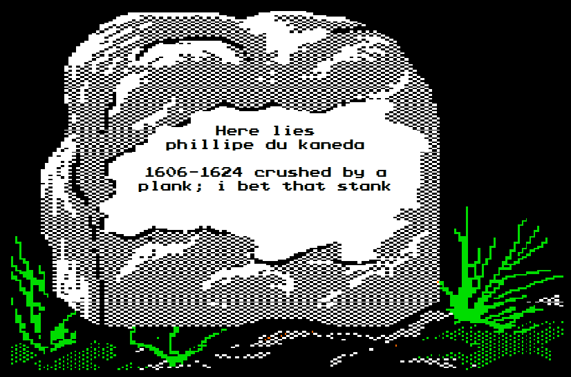

**Jean-Luc Aveline, 1607–1624** — *buried with his spade*
Died in the Cuirassiers' charge, Summer 1624, having taken Reckless Bravery 4. "For France!" — amended mid-charge to "For Glory!"

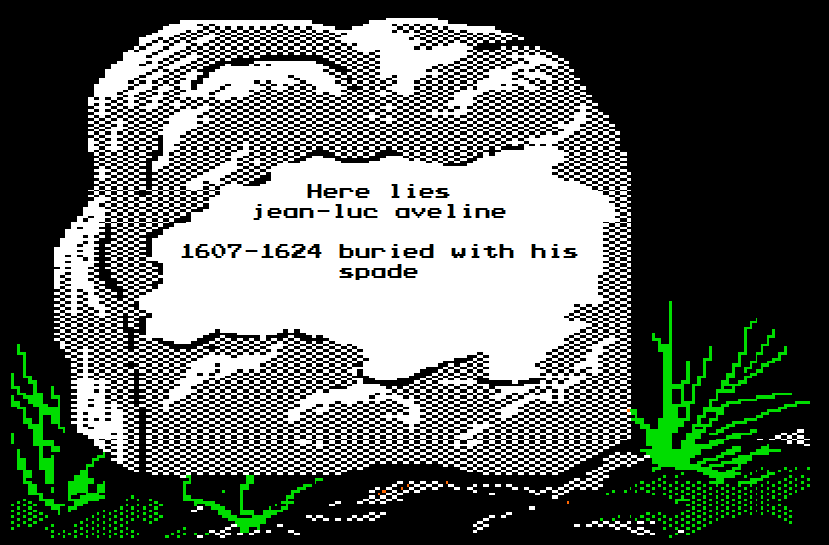

**Godefroy de Beaufosse, 1605–1624** — *never a poltroon*
Pulled from his mount and torn apart, Summer 1624 — minutes after his own verdict on Aveline's death in the charge, "Glory is a demanding mistress," which proved prophetic.

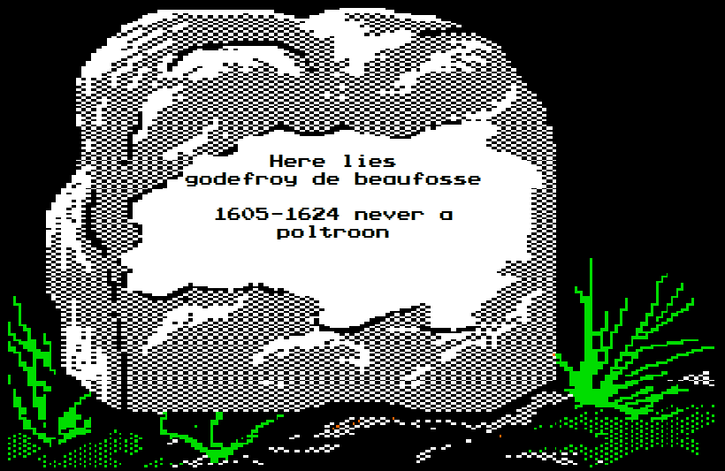

**Etienne de Mercoeur, 1600–1624** — *remembered by the Cardinal*
The richest man of the founding cohort, stabbed through his armor with rusty farm implements, Summer 1624.

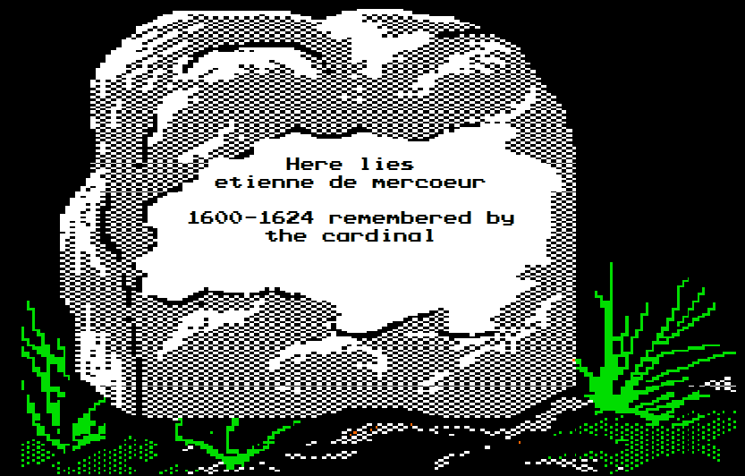

## The Year of the Republic (1625)

**Leon Mandelbrot, 1606–1625** — *he left his family behind*
Drowned in the surf at Blavet after striking his head on the landing plank, February 1625.

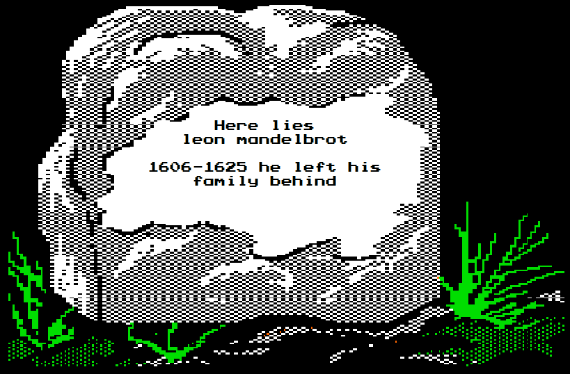

**Guy de Cavoye, 1607–1625** — *a real good Guy*
Exploded at Blavet, February 1625 — one month after proposing to Dice Golem and being accepted.

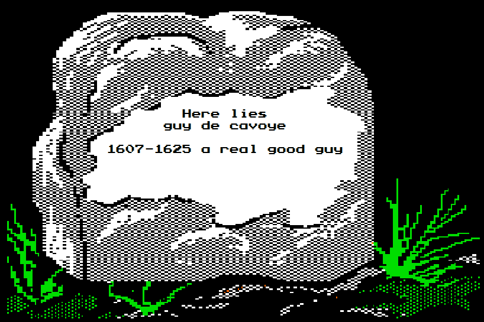

**Pierre de Tête, 1605–1625** — *he had a real eye for the blade*
Killed in the Nantes disaster, August 1625, by a Royal Foot Guards colonel roaring "FOR FRANCE!" — rapier through the eye. Last words: "No more quill pen pushing for me!"

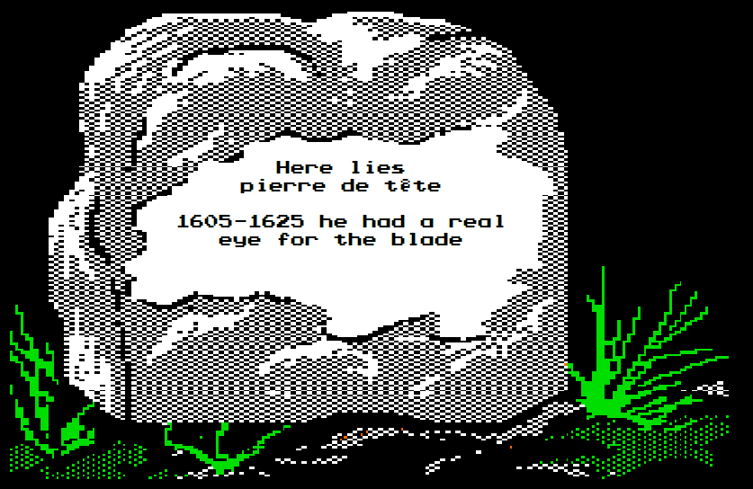

**Lucien Vaillancourt, 1608–1625** — *we thought he would never stop climbing*
Fell from the fortress wall of Île de Ré, November 1625, when his chosen handhold — a plank — proved rotten. The assault's only casualty: the fort was carried without a single enemy-inflicted loss.

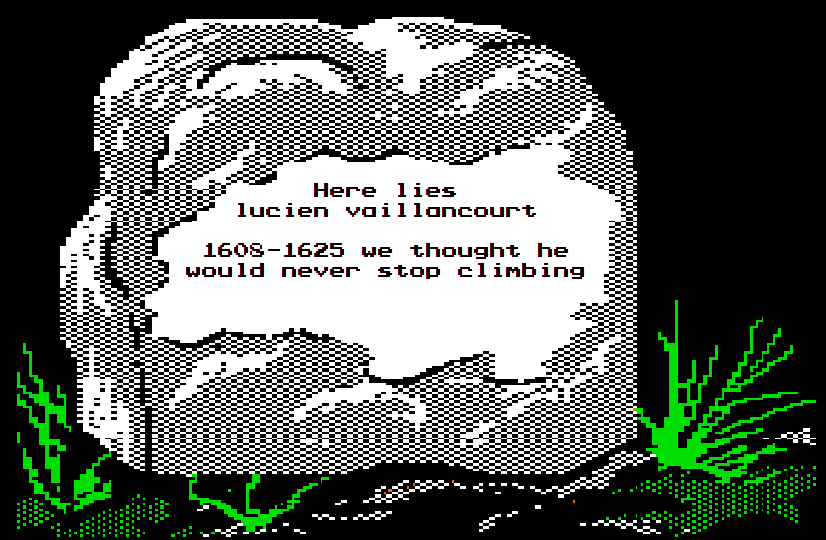

**Pain Loafmann, 1608–1625** — *wrongly j'accused*
The Gazette's "Stale Killer" (the streets preferred "Breadman Killer"), convicted and sentenced to the Frontier Regiments; officially graded "Sentence: 25% served. Convict: 0% rehabilitated" after his first campaign, and dead at the front before the year was out, November 1625.

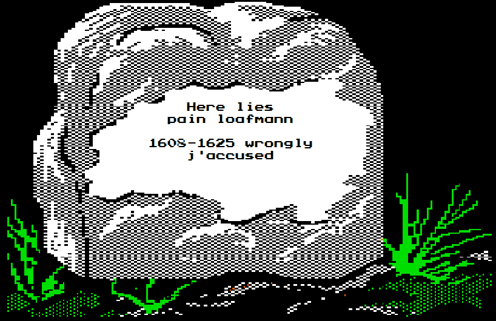

## The Year of the Thrown Cutlass (1626)

**Amand Baschet, 1609–1626** — *never threw a fight*
Killed instantly at the dragoon stables, January 1626, by Jean Rochant's hurled cutlass — snake eyes, one chance in thirty-six.

**Jean Rochant, 1605–1626** — *a fish out of water*
The Royal Marine who threw that cutlass; bled out at Andorra in October 1626, "his cutlass buried in one last foe."

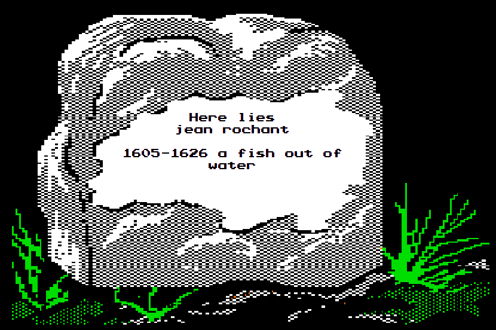

## The Year of the English (1627)

**Guerinet Durand, 1609–1627** — *lost his head over a woman*
Beheaded by Henri Toulouse at Red Phillip's, January 1627, in the very instant of his surrender.

**Jaques Peugeot, 1609–1627** — *couldn't stick the landing*
Leapt clear of the flames at Saint-Hélier, February 1627, and went through a rickety dock plank into the burning water.

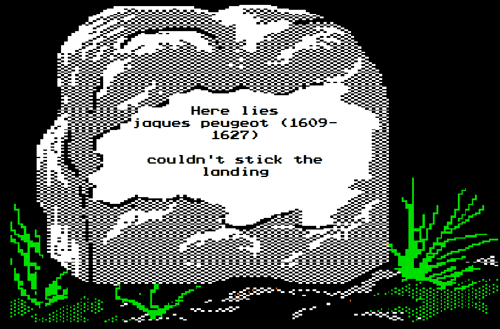

**Clemens Charron, 1611–1627** — *a heart too large for his own good*
The ox of the fields, killed at Jersey by a hunting arrow through the heart, February 1627. "Don't... tell anybody..."

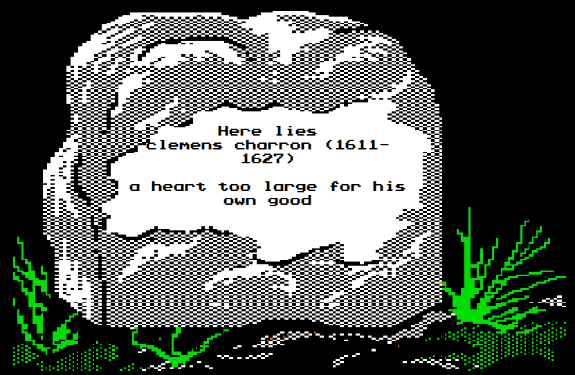

**Hercule Bonaparte, 1609–1627** — *his promising career went up in smoke*
Knight of France, Brigadier-General, shot from the saddle by the escaping Duke of Soubise amid the fires of Chevreuse, May 1627. "Nothing remains but a dream of ambition."

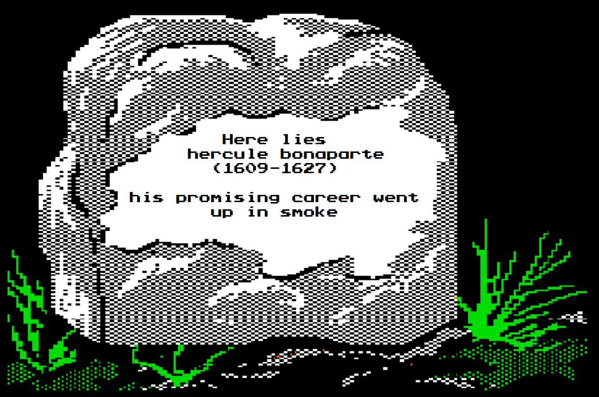

**Pépin Bonheur, 1609–1627** — *if only his standing had been lower*
Killed at Chevreuse, May 1627, by a smoldering, twirling two-by-four — on the backturn.

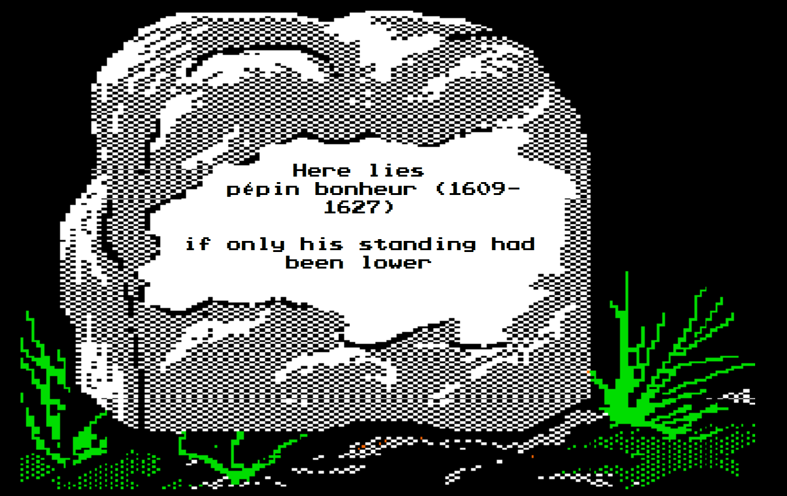

**Henri Toulouse, 1609–1627** — *'twas beauty killed the beast*
Survived the battle of Chevreuse; killed in his tent by the shaving razor of the girl he had rescued, May 1627. "Finally, the warm touch of a belle chère..."

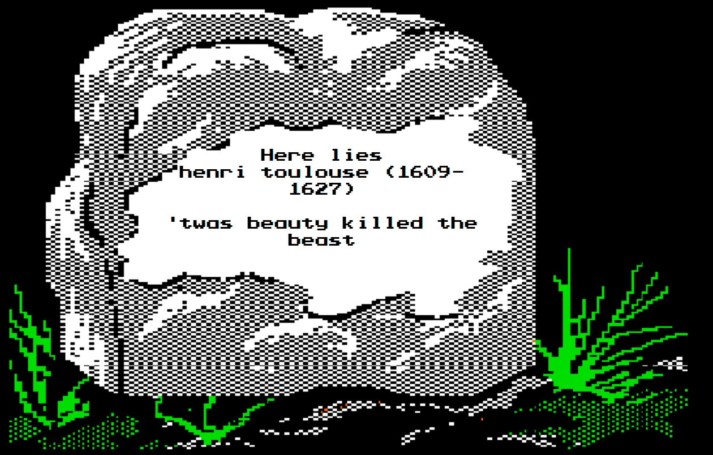

**Sébastien Lefebvre, 1611–1627** — *he was a man of strange fixation; now pioneering aviation*
Torn to shreds by grouse while hunting his dinner mid-battle, October 1627. Final thought: "petite futée…"

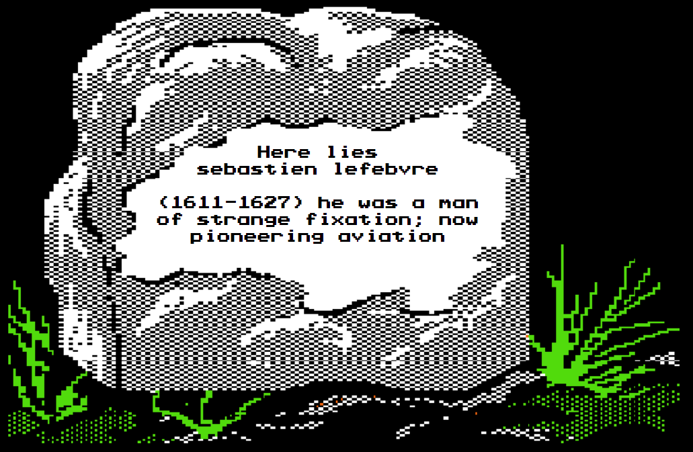

**Robert d'Engaux, 1609–1627** — *his career took him to new heights*
Thrown thirty feet from his caltrop-lamed horse, October 1627, then surrounded. "You will never take me al—"

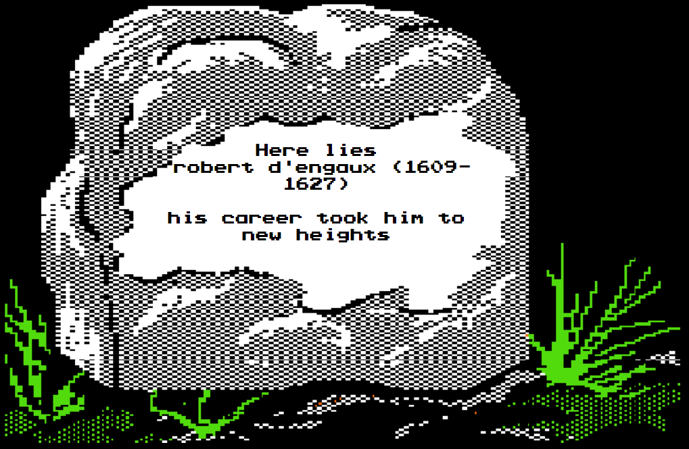

## The Year of the Long Siege (1628)

**Louis Laveuse, 1605–1628** — *lived like he had nothing to lose*
Killed by Jean Shawinigan at Red Phillip's, January 1628, over Adélaïde Blaise. "Mon dieu! Look what you have done to my coat."

**Jerome Greybeck, 1609–1628** — *his debts came due*
Died in a Norman hedgerow repelling the baronets' raid, February 1628, a last meal of poisonous berries in hand.

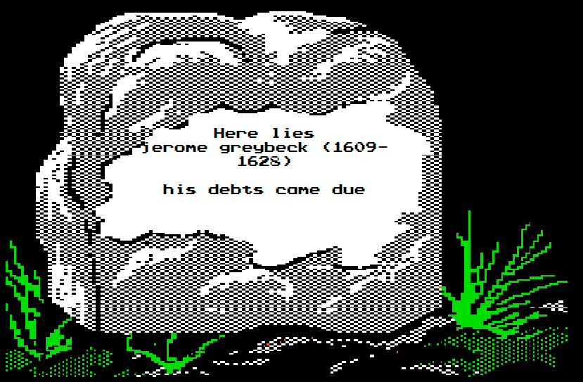

**Primo Tremblay, 1609–1628** — *ground into the ground, now into the ground*
Dragged to death behind his own spooked horse through a field of thistles, February 1628, on his ride of redemption.

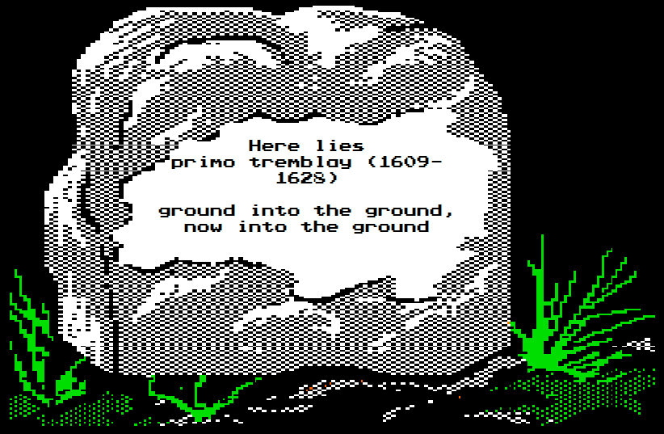

**Anton Dechets, 1612–1628** — *even in death a holy man*
Chest-shot by a booby-trapped smugglers' cannon in a hidden cove, Spring 1628.

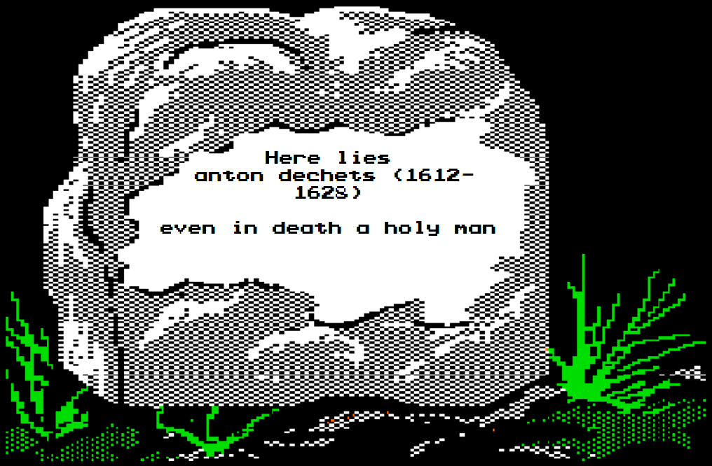

**Marius Thibodeaux, 1608–1628** — *his ship had just come in*
Knight, brevet Brigadier-General, captor of Buckingham; crushed on the beach by a galleon carried in on a freak wave, Spring 1628. "Angélique....."

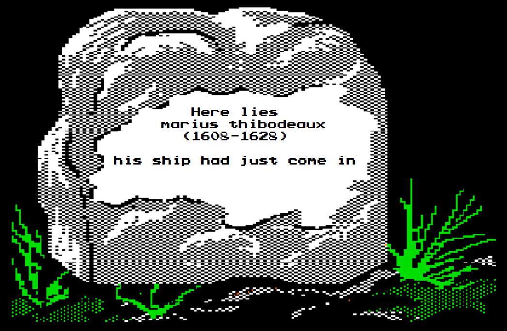

**Pierre d'Amboise, 1609–1628** — *great men require courage and luck. Pierre had courage*
Beheaded, Spring 1628, by the same cannonball that had just passed through Anton Dechets. "The battle continues much as it had before."

**Jean Shawinigan, ?–1628** — *out of time*
The time traveler, dissolved into light by temporal paradox mid-coup-de-grâce, Spring 1628. Remembered only as "Great Jean the Timeless."

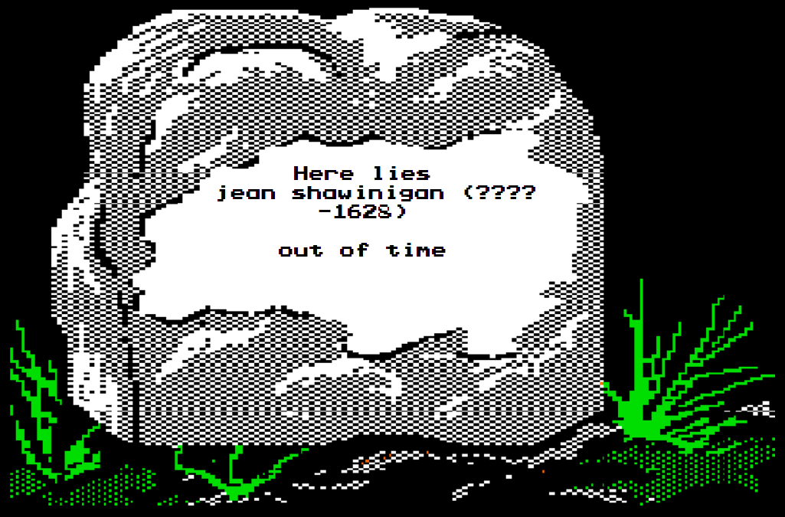

**Côme Touchard, 1611–1628** — *lived and died by the skin of his teeth*
Survived the cabbage-cart ambush at the fall of La Rochelle, October 1628; died of gangrene from the bite of an enraged greengrocer. "MY CABBAGESSSSSS!"

## The Last Campaign (1629)

**Albert Blastagarde, 1612–1629** — *a crushing loss to military science*
Inventor of Le Vaporisateur, flattened by his own creation's falling truss plank on the Creuse, Winter 1629 — the plank's final kill, five years after it took Phillipe du Kaneda. Player's verdict: "Worth."

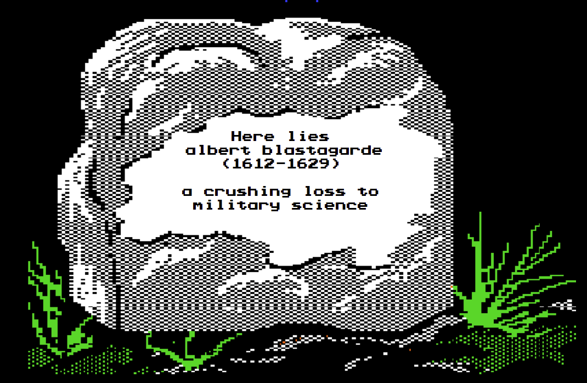

**Armand Dufour, 1612–1629** — *always ready to lend a hand*
Raised his arm to greet a lone rider on the Creuse, Winter 1629. The rider was the Duke of Rohan.

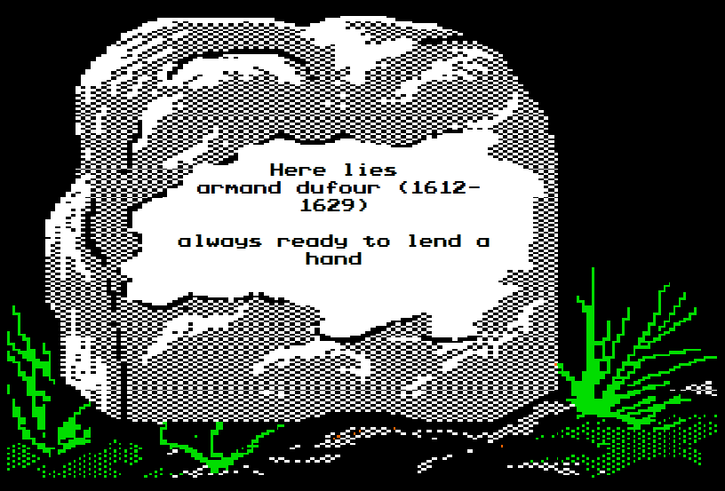

**Slade Imbee, 1610–1629** — *undefeated in battle*
Choked out an enemy officer bare-handed in the war's final action, and was erased in his moment of victory by an experimental shell. "He, and his victory, are never known again."

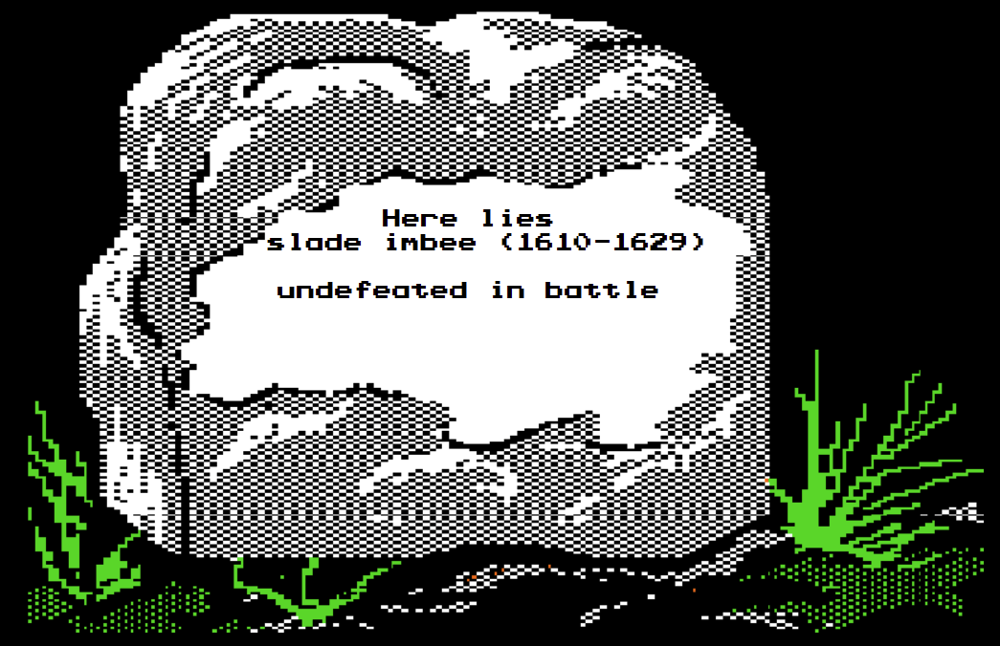

---

*One founder has no stone here: Alphonse Devereux, who "elected to go out in a blaze of glory" in the winter of 1626 and whose player left Paris with him. Let the elephant Hannibal stand as his memorial.*
