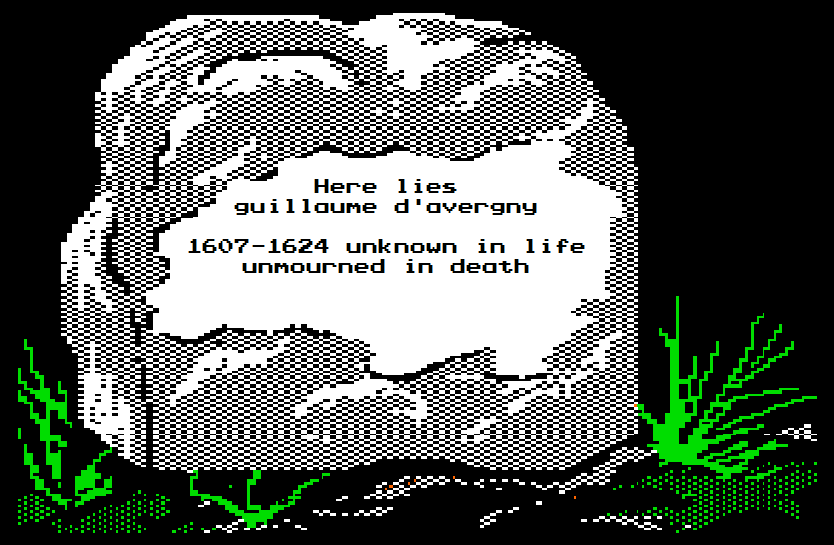

# Spring 1624 — First Blood on the Croquant Frontier

*April–May 1624 · resolved at the table 28–31 August 2020 · Mission: Defence · Theater: the frontier works, against the Croquant rebels*

The game's first campaign, and its first grave. Two men volunteered for the spring war against the Croquant peasant rebellion; one came back. Everything below is quoted verbatim from the table record.

---

## The situation

The rules of war had been posted before anyone marched. The Narrator's standing order for volunteers:

**Narrator** — "Summer is the regular campaign season, when the Minister of War will call up a certain number of brigades and send them to the front. Characters may also volunteer to campaign in the other seasons (Fall, Winter, Spring), along with their whole command if they hold one. […] Characters without a command may take a temporary leave-of-absence to serve in a Frontier Regiment. Characters retain their rank, or receive the rank of Private if they were not enlisted, and are paid at Gascon Regiment rates."

Why would a freshly commissioned captain of the Picardy Musketeers leave Paris for the frontier in spring? Guillaume d'Avergny told his friends plainly, in the streets, in April 1624 — rejected in love, broke, and proud:

**Guillaume d'Avergny** — "My friends, I've a confession. These past two months have been the most exciting and engaging of my life. Even so, a specter haunts me, hanging over my every thought and deed.

In truth, Mlle. Giteau's rejection was more than I could bear -- not just emotionally, but financially. I cannot remain in Paris and stay solvent. And now that I carry the honor of my regiment on my shoulders, as well as that of the d'Avergnys, I can ill afford to Disgrace my name.

I will be volunteering for the frontier on the first of the month. I'll see you on the other side of the war."

**Jean-Luc Aveline** — "Au revoir monsieur d'Avergny! May the frontier reward you with opportunities for glory!"

**Pierre de Tête** — "Stay safe, my friend. Let me lend you some reading materials. There is no culture at the frontier."

**Phillipe du Kaneda** — "Remember the wisdom of your cousin and his hatchet.  There is no honor in dying to those with none."

**Leon Mandelbrot** — "Make sure to bring us stories of the frontier when you return!"

*He would not return. On 28 August 2020 (May 1624 in game time) the Narrator opened the campaign:*

**Narrator** — "@Guillaume d'Avergny and @Pierre de Tête have volunteered for the Spring campaign against the Croquant rebels.. Guillaume has joined the Frontier Regiments, but Pierre has volunteered with his 3rd Squadron of Grand Duke Max's Dragoons."

> 🎲 Narrator rolls 1d6 — **2**

**Narrator** — "The Spring campaign will revolve around Defence."

**Pierre de Tête** — "Those peasants don't stand a chance against a proper soldier!"

**Narrator** — "Campaign will be resolved at the end of the month."

---

## The order of battle

A small, lonely war — no grand army, no brigades, no famous generals yet. The Narrator's entire order of battle for the defence:

**Narrator** — "The Frontier Regiment is operating independently on this defensive campaign. The Colonel leading the Frontier Regiment has an MA of 5. His adjutant has an MA of 2."

The player characters engaged:

- **Guillaume d'Avergny** — junior captain of the Picardy Musketeers, on leave-of-absence with the **Frontier Regiments**, posted to the front line of the defensive works. (Guillaume was, as it happens, the Narrator's own character — the GM's player account. The dice showed him no courtesy for it.)
- **Pierre de Tête** — junior major, **Grand Duke Max's Dragoons**, volunteering at the head of his own **3rd Squadron**.

Facing them: the Croquant peasant leagues in revolt, under the rebel leaders **Donat** and **Barran**.

---

## The record

*The month passed first in tedium. One letter survives from the works, and one reply from Paris:*

**Guillaume d'Avergny** — "This is the worst food I've ever had in my life. Why did I think war would be glorious? So far I've sat behind fortifications and tried not to use my nose."

**Leon Mandelbrot** — "Ah yes, war" … "Two weeks of extreme boredom followed by 10 minutes of sheer terror"

*On 31 August 2020 the Narrator called the session to order:*

**Narrator** — "Campaign Resolution"

**Narrator** — "The battle begins! Croquant rebels assault the position. The colonel rolls:"

> 🎲 Narrator rolls 1d6 — **1**

**Narrator** — "Battle result of 5"

*(A disaster. At the table, the Narrator's own verdict on the colonel's roll: "pure crap … Pierre has a chance of salvaging it a bit, I'm screwed.")*

**Narrator** — "@Pierre de Tête , roll 1d6 to determine the result for your 3rd Squadron."

**Pierre de Tête** — "With valiant heart, I order my captain to roll!"

> 🎲 Pierre de Tête rolls 1d6 — **6**

**Pierre de Tête** — "Promote that man!"

**Narrator** — "The colonel's orders are delivered by a muddy, shoeless child. Pierre reviews them, and recognizes the defensive plan for the sheer idiocy it is. As rebels pour over the battlements, Pierre leads his Squadron on a fighting withdrawal. As the rest of the defensive works fall, Pierre's command alone rides to safety."

---

## The reckoning

### Pierre de Tête — the fighting withdrawal

**Narrator** — "Pierre, roll 2d6 for Death against a 12. You may first decide to demonstrate Poltroonery or Reckless Bravery if you wish to modify the rolls"

**DancingHorse** *(checking)* — "To clarify, a 12 =death?"

**Narrator** — "yes, for each of these, you must roll at or above for it to happen"

**Pierre de Tête** — "A cool head prevails, no need for Reckless Bravery needed and Poltroonery is never an option!"

> 🎲 Pierre de Tête rolls 2d6 — (2+6) = **8** (Death target 12: survives)

**Narrator** — "Pierre survives!"

> 🎲 Pierre de Tête rolls 2d6 — (1+4) = **5** (Mentioned in Despatches target 12: no)
> 🎲 Pierre de Tête rolls 2d6 — (5+3) = **8** (Promotion target 10: no)
> 🎲 Pierre de Tête rolls 2d6 — (3+4) = **7** (Crowns target 9: no)

**Narrator** — "Pierre returns from the front having survived, but failed to distinguish himself in any other way"

**Narrator** — "Pierre, for this month you will receive pay as though you were a captain in the Gascon Regiment"

**WillWorker** *(at the table)* — "Lieutenant D. Golém strikes again!"

### Guillaume d'Avergny — the front line

**Narrator** — "Now, @Guillaume d'Avergny..."

**Guillaume d'Avergny** — "Is this the pale hand of Death before me?"

**Narrator** — "Guillaume is part of the front line of defenses. The battlement before him blows apart in the first rebel onslaught, and his position is quickly overwhelmed."

**Narrator** — "Roll against a 6 for Death."

**etirflita** *(at the table)* — "oof"

> 🎲 Guillaume d'Avergny rolls 2d6 — (6+4) = **10** (Death target 6: dies) ☠️☠️

**Narrator** — "Guillaume is annihilated"

**Pierre de Tête** — "Guillauuuuuuuummmmme!"

*The first player character death of the game — three weeks in, and it was the Narrator's own. The cemetery channel opened that evening with a single image:*

### The defeat, and what it bought

**Narrator** — "The frontier regiments have suffered a crushing defeat at the hands of the rebel leaders Donat and Barran. Their names are growing in popularity, and the rebellion threatens to spread as nearby peasantry wonder if they too can escape the ruinous tax burdens of the King."

**Narrator** — "The King charges the Minister of War to raise a great army to quell the rebellion once and for all."

*No honors, no promotions, no plunder. One captain's pay-packet, one corpse, and a summer of total war now guaranteed for every man in Paris.*

### Aftermath in the streets

*Minutes after the death roll, back in the streets of Paris — Jean-Luc Aveline had not yet heard:*

**Jean-Luc Aveline** — "When @Guillaume d'Avergny gets home from the front, I owe him a drink..."

**Narrator** — "Guillaume's sword is returned from the front and set aside in the post office for his family to claim. It sits in the corner for years, rusting away, before it is finally thrown away during a renovation."

**Jean-Luc Aveline** — "empty chairs at empty tables.... at Red Phillip's"

**Godefroy de Beaufosse** — "The pallor of death hangs over the city this day."

*That same evening, the survivor rode in through the gates:*

**Pierre de Tête** — "Ahh, the city, a haven of civilization! And womenfolk! A sight for sore eyes after a month on weary campaign. I'll need a drink."

**Jean-Luc Aveline** — "@Pierre de Tête, it seems being on campaign has served you well; I suspect you are back to full health after our 'tavern scuffle' at the Frog and Peach?"

**Pierre de Tête** — "Nearly, those were some deep cuts."

*And before midnight, a new gentleman appeared in the streets — the Narrator's next character, arriving with the ink of the death notice barely dry:*

**Jules Lavelle** — "Finally, I have convinced my father to permit me freedom in determining my own affairs. The old fool imagines the world still runs as though we were under Charlemagne. But no, it is a new age and a new day for Jules Lavelle!"

**Narrator** — "Spring 1624 draws to a close. Characters in Paris, submit your actions for June."

---

## Table talk

The tempting of fate, three days before the resolution:

- **Lithros** *(GM, playing Guillaume)* — "Dice Golem is nothing if not punctual"
- **etirflita** — "So Dice Golem is 'nothing' now? Tempting fate, aren't we Guillaume?"
- **WillWorker** — "Bah, he's on the front lines.  What could Dice Golem possibly do to him now...."
- **Lithros** — "Dice Golem can finally KILL"

And the eulogies, such as they were:

- **WillWorker** — "Eh, fuck 'em.  I didn't like the guy anyways." / **Lithros** — "he was kind of a stick-in-the-mud"
- **ArcticFox** — "On the bright side, you get to roll a new character!" / **Lithros** — "Yep looking forward to it"
- **etirflita** — "This past campaign was a big advertisement for going on campaigns." / **Lithros** — "That's why it's not a choice in the summer"
- **Lithros** *(on the odds for the coming summer, after suggesting poltroonery)* — "Discretion is the better part of valor. Cowardice is the better part of discretion" / **WillWorker** — "You spelled pragmatism wrong."

---

[Index](README.md) · [Next campaign →](02-summer-1624.md)
