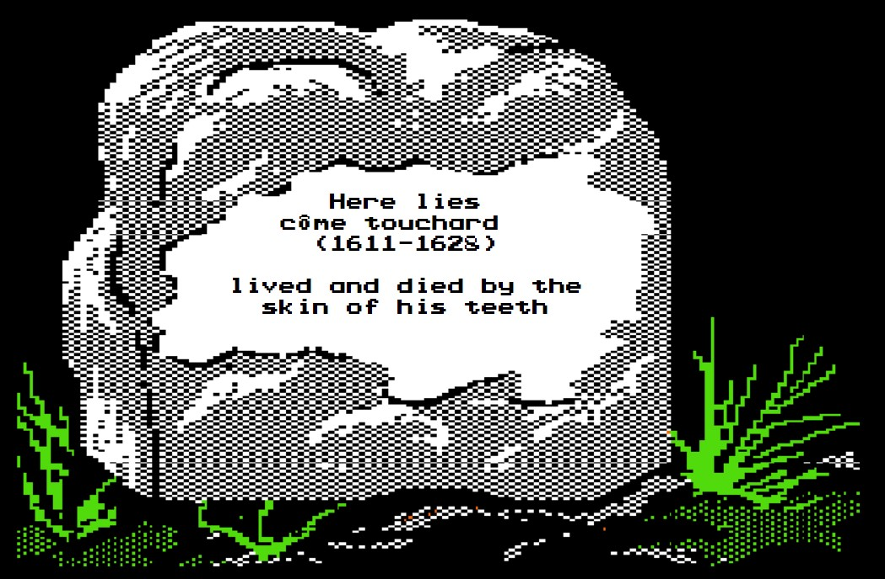

# Fall 1628 — The Fall of La Rochelle, and a Vortex of Leafy Death

*September – November 1628 · resolved at the table 28–29 March 2022 (deployment fixed 9 February) · Mission: Field Operations · Theater: refugee checkpoints on the roads out of La Rochelle*

---

## The situation

La Rochelle was already lost when the fall season opened. After the summer's failed English relief at the seawall, the great siege reached its end — and the army's last task was not a battle at all, but a manhunt.

**Narrator** — "The Fall Campaign"

> 🎲 The Narrator rolls 1d6 — **6**

**Narrator** — "This is a Field Operations campaign."

**Narrator** — "The siege has cracked the city wide open. The last Huguenot holdouts and English stragglers flee La Rochelle in droves. Among their number, dozens of English commanders and French nobles, chiefly to blame for funding the multi-year rebellion, try to slip out amidst the filthy peasantry. The army, such as it is in the Fall, has been assigned inspection duty in the field, searching the endless lines of refugees for persons of interest."

*The deployment had been settled weeks earlier, in the off-season channel, when the Narrator called for volunteering rolls:*

**Narrator** — "The following players should roll 1d6 to see if their commanders are volunteering them for the Fall Campaign: @Slade Imbee @Jean Renault @CitrusNotes"

> 🎲 Armand Dufour rolls 1d6 — **6** (his commander volunteers the regiment)

**Narrator** — "The Picardy Musketeers, including @CitrusNotes, @Blastagarded, and @Ghôst Touchard, will be deploying this season (unless anyone wishes to use Influence on the commander -- a mere Major!)"

**Armand Dufour** — "To glory!"

*Jean Renault's Cuirassiers rolled a 5 and stayed home. Slade Imbee rolled a 2, then tried diplomacy:*

**Slade Imbee** — "Am I to understand from my roll that my commanders were so... impressed with my performance in this last venture that they see my presence in the next of the utmost importance and I am to report to duty immediatly?"

**Narrator** — "Your commander volunteers on a 6 -- you'll be in Paris this season, unless/until you choose to volunteer on your own."

---

## The order of battle

**Narrator** — "Deploying:

Bg. Gen. @Curtis Sinnoch leading the 1st Brigade, including in the Picardy Musketeers Captains @CitrusNotes and @Blastagarded, and Pvt. @Ghôst Touchard.

Lt. Col. @Jules Lavelle commanding the Royal Foot Guards.

@Joseph Bousain has volunteered as a private in the Frontier Regiment."

**Narrator** — "The Frontier Regiment is commanded by Col. Thomas Alard, a savvy veteran of the Spanish Campaigns."

*The player characters at the checkpoints:*

| Character | Rank / Post | Station |
|---|---|---|
| **Curtis Sinnoch** | Brigadier-General | Commanding the 1st Brigade — senior officer on the field |
| **Armand Dufour** | Captain, E Company | Picardy Musketeers, 1st Brigade |
| **Albert Blastagarde** | Captain, F Company ("The F is for Firepower") | Picardy Musketeers, 1st Brigade |
| **Côme Touchard** | Private, E Company | Picardy Musketeers, 1st Brigade |
| **Jules Lavelle** | Baron, Lieutenant Colonel | Commanding the Royal Foot Guards |
| **Joseph Bousain** | Private (volunteer) | Frontier Regiment, under Col. Thomas Alard |

*The NPC command: Col. Thomas Alard of the Frontier Regiment, "a savvy veteran of the Spanish Campaigns," and Maj. Jean Ouvrard, commanding the Picardy Musketeers — a man about to earn his place in the annals of produce-related warfare.*

---

## The record

**Narrator** — "@Curtis Sinnoch, as senior officer on the field, you may set the tone of the endeavor."

**Curtis Sinnoch** — "Curtis paced the halls of Bothwells - his need to stay in Paris during the Summer campaign now unleashing months of pent up rage and frustration upon the poor, unsuspecting English. An orderly meekly started to suggest holding some strength back and was silenced with a chopping motion
Composing himself, Curtis heads to the 1st battalion HQ and sends his men to gather any and all available soldiers and officers, dragging some unwilling from their beds as needed
'We are the finest of France! We will not allow the English to sully our lands any further! At dawn, the entire 1st brigade will mobilize and quash this uprising for good! I believe the term is "overwhelming firepower" yes? What others may otherwise seem as a troublesome bother, I see as an insidious attempt to poison France herself from within! No quarter will be given, and none shall be expected! Brave sons of France - you've been called, to deliver upon our enemy a DIVINE RETRIBUTION! With each musket shot, LET THUNDER BELLOW! With each sabre thrust, LET LIGHTNING STRIKE! We SHALL NOT, WILL NOT allow these filth to continue to contaminate our grounds! We ride! WE RIDE TO GLORY!'"

*The speech drew a 😈. In the OOC channel, two minutes after the campaign was announced, Côme Touchard's player had already set a different tone:*

**Ghôst Touchard** *(OOC)* — "Leeeeeeeroyyyyyy Jeeeeenkiiiiiins!"

### The 1st Brigade — Bg. Gen. Curtis Sinnoch

**Narrator** — "One week later, the 1st Brigade stands in bored ranks, blithely processing one refugee after another. @Curtis Sinnoch, give any relevant orders to your colonels and roll for your result."

**Curtis Sinnoch** — "Men, the enemy is insidious. They will play the part of the lowly peasant until you turn your backs, then your throat is CUT! Keep your men diligent and observant! Frequent guard changes to keep our processors sharp, with lookouts both forward and aft of the stations to alert of potential issues. I want a second task force of troops behind the primary processing stations at the ready should they need to support, or better yet flank an opposing force. We know the Narrator is a Jackass, and you have full permission to hunt down his kin.
You've all trained and studied well, and all have full permission to deviate from orders to hunt targets of opportunity - the higher the rank, the more leniency will be granted. For FRANCE!"

> 🎲 Bg. Gen. Sinnoch's command roll: 1d6 — **1** *(the dice bot's message earned a lone 😴)*

**Narrator** — "Your colonels listen closely, taking your words at face value, and the screams of peasants who've lost their homes and livelihoods can be heard from your checkpoints for days. In spite of it all, other than a few coins of English currency and a single English soldier in a dress doing his best French accent, your troops fail to do much more than terrorize their own countrymen. Result is a 4 - Inconclusive."

### The Picardy Musketeers — Maj. Jean Ouvrard, and the cabbage cart

**Narrator** — "Maj. Jean Ouvrard, commanding the Picardy Musketeers, decides to personally intervene when he notices a greengrocer's cartful of cabbages seems oddly lumpy. He orders his men to perform a closer inspection."

> 🎲 Maj. Ouvrard's command roll: 1d6 — **1**

**Narrator** — "A gang of wanted criminals bursts of out of the cabbages, swinging wickedly curved blades in a vortex of leafy death. The nearest musketeers are cut down instantly, and the ruffians slip away into the sea of displaced peasants. The result is 5 - Own driven from field."

### The Royal Foot Guards — Lt. Col. Jules Lavelle

**Narrator** — "@Jules Lavelle, give your orders and roll."

**Jules Lavelle** — "Would that I were serving under my former commander! But now is Lavelle's time to shine. Men, form orderly ranks, just like the royal promenade. We shall keep these stinking commoners moving along before our noses have a chance to take in their malodorous stench. They're rats and rabble, spare them not a second glance!"

> 🎲 Lt. Col. Lavelle's command roll: 1d6 — **2**

*The outcome narrations for the rest of the night were posted from the GM's player account, but the voice is the Narrator's:*

**Narrator** — "As the days pass, more and more of the Royal Foot Guards turn up missing. Closer inspection reveals their bodies stashed under a nearby hedgerow. Some English spies have been cutting their throats at night watch, after the second wine ration had been given. After taking heavy losses in this way, the Guards are forced to retreat. The result is 5 - Own driven from field."

### The Frontier Regiment — Col. Thomas Alard

**Narrator** — "Col. Alard of the Frontier Regiment takes a more pointed approach. He orders his men to search every passing citizen, no matter the delay. The men of the Frontier Regiment are not above getting their hands dirty."

> 🎲 Col. Alard's command roll: 1d6 — **1**

**Narrator** — "Open violence breaks out between the peasants and Frontiersmen, as the refugees accuse the soldiers of being thieves and pickpockets themselves. Some of the soldiers fire into the crowd, and the resulting battle leaves dozens of volunteers bloody or dead. Col. Alard faces court-martial for his laxity. The result is 5 - Own driven from field."

*Thus ended the field operations of Fall 1628: one Inconclusive, three Own driven from field — every defeat inflicted by cabbages, wine rations, and the French people themselves. Not one English commander was caught on the record.*

---

## The reckoning

*The targets, as announced:*

**Narrator** — "@Curtis Sinnoch, your rolls are Death 12, Mention 12, Promotion 6, Crowns 6"

**Narrator** — "@CitrusNotes and @Blastagarded, your rolls are Death 8, Mention 10, Promotion 7, Crowns 11"

**Narrator** — "@Ghôst Touchard, your rolls are Death 7, Mention 10, Promotion 7, Crowns 12"

**Narrator** — "@Joseph Bousain, your rolls are Death 6, Mention 10, Promotion 7, Crowns 11"

**Narrator** — "@Jules Lavelle, your rolls are Death 12, Mention 10, Promotion 7, Crowns 8"

### Armand Dufour — Captain, E Company, Picardy Musketeers

> 🎲 Armand Dufour rolls 2d6 death — **5** (Death target 8: survives)
> 🎲 Armand Dufour rolls 2d6 mention — **3** (Mention target 10: no mention)
> 🎲 Armand Dufour rolls 2d6 promotion — **5** (Promotion target 7: no promotion)
> 🎲 Armand Dufour rolls 2d6 crowns — **12** (Crowns target 11: loot!)

**Narrator** — "You manage to scavenge a few crowns scattered from the pockets of your fallen comrades. After the vegetable maelstrom, there's no way to tell who they may have once belonged to. Roll 1d6."

> 🎲 Armand Dufour rolls 1d6 — **5**

**Narrator** — "You managed to scrounge up 250 crowns from the regimental tontine."

### Curtis Sinnoch — Brigadier-General, 1st Brigade

**Curtis Sinnoch** *(at the table)* — "Straight Rolls across the board! For Life!"

> 🎲 Curtis Sinnoch rolls 2d6 — **6** (Death target 12) — **"I survive!"**
> 🎲 Curtis Sinnoch rolls 2d6 — **7** (Mention target 12) — **"No mention!"**
> 🎲 Curtis Sinnoch rolls 2d6 — **10** (Promotion target 6) — **"Promoted!"**
> 🎲 Curtis Sinnoch rolls 2d6 — **11** (Crowns target 6: loot!)

**Narrator** — "Your rank has risen to permanent Brigadier-General. The colonel position in the Royal Foot Guards is left open"

**Curtis Sinnoch** *(at the table)* — "Dolla Dolla Bills Y'all!"

**Narrator** — "Roll 1d6"

> 🎲 Curtis Sinnoch rolls 1d6 — **1**

*And on that lowest of loot rolls, the Narrator delivered the season's longest personal vignette — the hollow-tree judgment:*

**Narrator** — "A fat French merchant is brought before Curtis, accused by his maid of having been a Huguenot collaborator. He listens carefully to the old woman's story as the man sweats in the dark of the field tent. Having heard enough, Curtis dismisses her and prepare to deliver the man his judgment. 'Please, sir,' he begs, 'I have great riches hidden in the hills. Wealth beyond your dreams! I will pay you, just let me go!'

The man falls to his knees, and Curtis nods slightly. 'Give me your treasures, and I will show you mercy.'

The merchant, walking ahead, leads Curtis and his retinue out into the night. After ten minutes' walk, they come upon a small spring surrounding by a little copse of trees. The merchant runs his hands over one of the trees, then gasps in delight, yanking the side of the tree open. Immediately, hundreds of gold coins spill out from the hollowed trunk, glittering in the torchlight.

The merchant smiles broadly. 'There you are, sir. I give all this to you. Only let me live.'

Curtis frowns from atop his horse. 'There is a problem here, scoundrel. This is traitor's money; it belongs to the crown. It is not yours to give.'

The merchant still has a confused expression on his face as Curtis gives the order, and his adjutant slits the sympathizer's throat.

As a reward for the vast riches he's recovered, Curtis receives a permanent promotion, and a 50 crown bonus."

### Jules Lavelle — Baron, Lieutenant Colonel, Royal Foot Guards

> 🎲 Jules Lavelle rolls 2d6 death — **4** (Death target 12: survives)
> 🎲 Jules Lavelle rolls 2d6 mention — **3** (Mention target 10: no mention)
> 🎲 Jules Lavelle rolls 2d6 promotion — **4** (Promotion target 7: no promotion)
> 🎲 Jules Lavelle rolls 2d6 crowns — **8** (Crowns target 8: loot!)
> 🎲 Jules Lavelle rolls 1d6 — **3**

**Narrator** — "150 crowns"

**Jules Lavelle** — "The scion of Lavelle survives another day!"

### Albert Blastagarde — Captain, F Company, Picardy Musketeers

**Albert Blastagarde** — "Capt. Blastagarde takes his General's orders to heart. After all, for the past three months he has had nothing else to do but privately secure prototypes of various armaments from his family's business for his Company... along with an ample supply of regular munitions, including a personal cannon for any soldier who requested one.

And so, as the refugees lined up for inspection, those who found themselves in the line for Company F were questioned not at sword point or with the barrel of a musket pointed at their head, but in front of a wall of cannons backed by musketeers which ensured any English invader who tried to flee would find themselves quickly and overwhelmingly surrounded by an insurmountable quantity of gun power propelled munitions ranging from pistol pellets to cannon balls. A couple of his soldiers even opted for an experimental miniature ballista which fired from a series of five auto-loaded javelins in under three seconds. And so, but for a few volleys triggered by either English scum; the overly excited; or, simply the purely terrified, the line for Company F proceeded in a largely orderly manner..."

> 🎲 Albert Blastagarde rolls 2d6 death — **7** (Death target 8: survives)
> 🎲 Albert Blastagarde rolls 2d6 mention — **7** (Mention target 10: no mention)
> 🎲 Albert Blastagarde rolls 2d6 promotion — **5** (Promotion target 7: no promotion)
> 🎲 Albert Blastagarde rolls 2d6 crowns — **8** (Crowns target 11: no crowns)

**Albert Blastagarde** — "Despite the lack of personal advancement, Capt. Blastagarde finds peace in the ample number of notes and feedback received from the endeavor, including initial designs for a new form of cannon ball which will mitigate against it ricocheting back at the shooter when it hits another similarly targeted cannon ball in mid flight."

### Côme Touchard — Private, E Company, Picardy Musketeers

*Touchard, living "on borrowed time" since he'd refused to buy a commission back in June, declared for poltroonery — shifting his Death target from 7 up to a safer 10:*

**Côme Touchard** — "With cowardice of +3 (and a modified death roll of 10) I flee for my life!"

> 🎲 Côme Touchard rolls 2d6 — **10** (Death target 7, cowardice +3 → target 10: rolls it exactly — DEAD)

**Côme Touchard** *(at the table)* — "Whoops"

*Hours later, the Narrator returned to write him out in full:*

**Narrator** — "Having hidden behind a rock and successfully avoided the wild ambush, Côme wanders over to observe the cleanup efforts and see if he can pick up any leftovers from the tontine.

Meanwhile, the greengrocer stares in horror at what's left of his bloody, dismembered produce. Côme, noticing the man's distress, approaches to offer a consoling word. The greengrocer turns on him, livid, and hisses 'MY CABBAGESSSSSSS!' before baring his teeth and going straight for Côme's throat.

Côme fights him off, but not without losing a few bits of skin in the process. He applies a dirty bandage and thinks nothing more of the matter.

The wounds swiftly turn gangrenous, and he expires in a hospital tent a few days later."

*So died Côme Touchard — survivor of the ambush, victim of the bite — the only man in the campaign killed by the man whose cabbages the army had already destroyed. His stone joined the cemetery that same morning:*

### Joseph Bousain — Private (volunteer), Frontier Regiment

> 🎲 Joseph Bousain rolls 2d6 — **2** (Death target 6: survives)
> 🎲 Joseph Bousain rolls 2d6 — **7** (Mention target 10: no mention)
> 🎲 Joseph Bousain rolls 2d6 — **2** (Promotion target 7: no promotion)
> 🎲 Joseph Bousain rolls 2d6 — **9** (Crowns target 11: no crowns)

**Narrator** — "Congratulations on your survival."

### Honors and casualties

*The Picardy Musketeers' officer corps had fared far worse than the players:*

**Narrator** — "Due to the deaths of nearly the entire command staff of the Picardy Musketeers, @CitrusNotes and @Blastagarded have been given acting command of 1st and 3rd Battalion, respectively." *(the announcement drew a 👏)*

*And then the Cardinal closed the theater:*

**Narrator** — "The campaign wraps up, and each officer receives a personal note of thanks from the Cardinal for his part in the siege and ending the Protestant menace. 'Never again will the shores of France be sullied by the presence of those who do not worship Christ in accordance with the doctrine of the Pope in Rome,' reads the rose-scented missive. The European theater of this bloody, all-consuming war is at an end."

*The season's ledger: Curtis Sinnoch confirmed as permanent Brigadier-General with a 50-crown bonus (and a hollow tree's worth of traitor's gold recovered for the crown); Armand Dufour up 250 crowns and an acting battalion command; Albert Blastagarde an acting battalion command and some ballistics notes; Jules Lavelle 150 crowns; Joseph Bousain his life; Côme Touchard a grave. Within days the Narrator opened the spring volunteering rolls — the Picardy Musketeers and the Crown Prince Cuirassiers both declined. The armies of France were going home.*

---

## Table talk

**Ghôst Touchard** *(in general-ooc, two minutes after the campaign was announced)* — "Leeeeeeeroyyyyyy Jeeeeenkiiiiiins!"

**Curtis Sinnoch** *(mid-speech, in his official checkpoint orders)* — "We know the Narrator is a Jackass, and you have full permission to hunt down his kin."

**Curtis Sinnoch** *(opening his resolution)* — "Straight Rolls across the board! For Life!" *…and, on hitting his crowns target:* "Dolla Dolla Bills Y'all!"

**Ghôst Touchard** *(having rolled exactly his modified death number)* — "Whoops"

**CitrusNotes** *(in general-ooc, minutes after his rolls)* — "Well! I survived and some coin in the pocket. Can't complain all things considered"

**Slade Imbee** *(on learning he had not been voluntold)* — "Am I to understand from my roll that my commanders were so... impressed with my performance in this last venture that they see my presence in the next of the utmost importance and I am to report to duty immediatly?"

---

[← Previous campaign](18-summer-1628-seawall.md) · [Index](README.md) · [Next campaign →](20-winter-1629-creuse.md)
