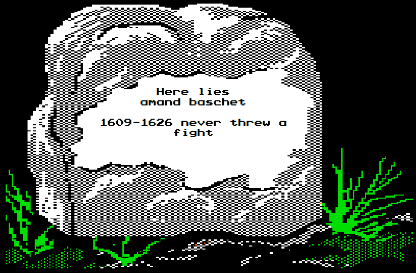

# Jean Rochant vs. Amand Baschet

*January 1626 · the training yard of the Grand Duke Max's Dragoons, outside Paris · Cause: the stolen mistress Adélaïde Blaise ("Mr. Steal Yo' Girl") · cutlass against sabre*

The eighth duel of the game, and the first one to kill a man. Every death before this one had come on campaign — planks, surf, rusty farm implements. This one came in a regimental courtyard, at the end of the most bloodless twenty-three rounds ever fenced in Paris: a wronged Royal Marine with a cutlass chasing a pacifist society painter who jumped back, blocked, rested, and offered his pursuer lunch, a salad, and a portraiture session while doing it. Amand Baschet had stolen Jean Rochant's mistress while Jean was away at the front; Amand's player, knowing her Renaissance Man could not win a fair exchange of blows, programmed twelve-move sequences made almost entirely of evasion and very nearly talked the whole thing into a draw. Then, on round twenty-four, Jean Rochant threw his cutlass. The dice came up 1 and 1.

*Editorial note: quoted text is verbatim from the game record; Discord @-mentions inside quotations are rendered as the character's name.*

---

## The quarrel

### The lady and the wallet

*April 1625. Jean Rochant, a Royal Marines sub-altern of no family and careful funds, spent extravagantly to court Adélaïde Blaise:*

**Narrator** — "Jean Rochant, roll to court Adélaïde Blaise (SL 9). With your extra spending, you should be aiming for a 4." — *then, correcting himself:* "Correction, with your extravagance, you should be aiming for a 2."

> 🎲 Jean Rochant rolls 1d6 — **5** (needed 2: the lady is won)

**Narrator** — "The lady finds you acceptable. Or is it your wallet she admires?"

**Henri Toulouse** — "I ain't saying she's a gold digger, but she ain't messin' with no penniless commoners."

**Jean Rochant** — "*is now penniless*" ... "Not really but... almost"

**Jules Lavelle** — "A penniless gentleman is still a gentleman. For a few social levels, anyway."

### The stealing (September 1625)

*While Jean campaigned with the Marines, a newly arrived painter of means called on his mistress. The player's courting scene deserves its full length:*

**Amand Baschet** — "Having arranged it all with the household steward in advance, Adélaïde walks into the drawing room to meet her new watercolors tutor, but is astonished to see that the room has been transformed. Draped with painted fabrics and false rocks, it is now a Neptunian set with an elegantly carved seashell poised in the center. A carefully coiffed young man in an elegant painter's smock waits for her gaze to drift to him; his eyes drinking in her renowned beauty. When her gorgeous eyes finally alight on his, he bows and presents her with an elegant box, 'For you mademoiselle. The finishing touch before we transform you into Aphrodite herself; though you only need the Grecian silks.' Inside the box is a beautiful Grecian style dress in pink silk with a crown made of sea stars. Amand invites her to change behind a screen with the help of her handmaiden and prepares his oil paints and canvas."

> 🎲 Amand Baschet rolls 1d6 — **3** (needed 2: success)

**Narrator** — "The lady abandons her lover and embraces this dashing new gentleman."

**Henri Toulouse** — "As I was saying, purse strings."

### The December challenge

*Jean came home from the front in December 1625 and made his grievance public in the streets of Paris:*

**Jean Rochant** — "I return from the front, after honorably defending France under the command of Alphonse Devereux only to discovery that my dearest Adelaide Blaise has been stolen away by the dishonorable snake Amand Baschet, who took advantage of my service to king and country to take advantage and become, as the colloquialism in the colonies goes 'Mr. Steal Yo' Girl.' As a result, I issue a December challenge to Amand Baschet, while not for Mme. Blaise's hand, but for his dishonorable actions."

**Marius Thibodeaux** — "It seems that Mlle. Blaise isn't the only one demanding satisfaction!"

**Jean Rochant** — "Oh have you met her Marius Thibodeaux?"

**Marius Thibodeaux** — "I haven't the pleasure"

**Jean Rochant** — "Then I will ask you not to speak of her in such a manner! Adelaide is a sweet girl, clearly misled by that snake!"

**Jules Lavelle** — "Amand seems a good enough fellow to me. How long did you leave her bed cold, anyway?"

**Jean Rochant** — "Are you questioning my service to France? It was not even four months! I wrote her twice weekly, sometimes more!"

**Jules Lavelle** — "I admire your service, but I understand why a lady might prefer a man slightly less committed to his country."

**Jean Rochant** — "Ah, but when one is volunteered, the choices are to serve admirably or to quit dishonorably!" ... "I believe that any Frenchwoman truthy worthy of calling herself as such would far and away prefer someone who does not run when called to serve"

**Curtis Sinnoch** — "Having once courted the fine Adelaide, I must concur with your assessment Jean Rochant - your challenge is just!"

**Jean Rochant** — "And as you will note, I do not blame Adelaide, but rather that coward Amand Baschet, who sits in Paris while the rest of us stumble on the beaches and fight for country!" ... "Curtis Sinnoch Thank you my good man! Come January, let me buy you a drink!"

**Jules Lavelle** — "Come now, the man just arrived. He hadn't even the chance to enlist until last month."

**Jean Rochant** — "But he had time to court another man's mistress?!"

**Jules Lavelle** — "He is a cavalryman; he was in need of a sturdy mount."

**Marius Thibodeaux** — "Then he was in luck!"

**Jean Rochant** — "With that attitude he should have gone for a more experienced mistress!"

**Jules Lavelle** — "You are correct. Certainly she would not have gotten very much experience from your courtship."

**Jean Rochant** — "Alas, when country calls. But I assure you, she got experience nonetheless"

*That afternoon the accused finally answered — with condolences and a sales pitch:*

**Amand Baschet** — "Now, now M. Rochant! I assure you that no insult was intended. Such is the nature of love; it may ebb and flow as easily as the tides upon the shores. It seems the life of a campaigning Sub-Altern such as yourself is full of trials and hardships, but certainly, dear Adelaide does not need to be subject to those hardships as well."

**Amand Baschet** — "We need not consider shedding blood over something so natural as a change of heart. Why don't you sit for a portraiture session and you'll leave with something truly noble to send home to your family. A well-respected son is the jewel of a mother and father's eye."

**Jean Rochant** — "YOU STEAL MY MISTRESS AND NOW YOU THROW MY LACK OF PARENTS IN MY FACE?"

**Jules Lavelle** — "Perhaps you should be grateful. Were your parents alive, he might have tried to steal their affections as well."

**Jean Rochant** — "Mr. Lavelle, I have no cause to duel you, however should you continue to insult me, I will have no choice but to duel you as well!"

### Interlude: hatred as courtship

*Rage proved a fine cologne. That same December, Jean courted the lady Laurence Caillat and rolled a 6:*

**Narrator** — "The lady is simply entranced by the fiery look in your eyes, the hatred with which you speak the name 'Baschet.'"

### The stable gate (January 1626)

*The challenge hung over the holidays; Amand did not present himself. So in the fourth week of January, Jean went and found him. The Narrator set the scene at the Dragoons' headquarters:*

**Narrator** — "The Grand Duke Max Dragoons' regimental headquarters is a simple affair, with stables, a small parade ground, and a training yard bunched together just outside the city. Although the furnishings are humble, the place is kept meticulously clean by scores of privates tasked with caring for the horses and weapons.

Amand Baschet has been spending more and more time there, practicing with his sabre, and his dedication to training is becoming well-known. So well-known, in fact, that Jean Rochant has little trouble tracking him down.

As Amand goes through his practice drills, lost in the hypnotic, sinuous patterns of the sabre's movements, he pays little heed to his surroundings. He only opens his eyes when he realizes things have gotten much too quiet. The normal hum of conversation and husbandry has fallen away, and the grooms and privates are all staring at the courtyard.

Jean stands at the gate, hand on his weapon, fury in his eyes."

**Amand Baschet** — "*Amand realizes that the non-descript brown cloak he's been skulking around in is utterly ineffective when he keeps a regular schedule.*"

**Amand Baschet** — "*He sighs heavily, now wishing he'd gone with Adélaïde to visit her great-aunt as he was invited.*"

*Then he tried, one last time, to recruit his way out of it:*

**Amand Baschet** — "Good M. Rochant! Are you ready to prove yourself worthy of the Grand Duke Max's Dragoons? I can put in a good work with the Lieutenant, especially given your service record!" ... "Right this way to the recruiter's office..."

**Amand Baschet** — "You know Jean, may I call you Jean? I really admire your fighting spirit and it's such a shame that you've been stuck in a sub-altern's position. Your natural talents are being overlooked by your superior officers. Perhaps this change is exactly what you've been needing. And AH! What could be better than to be co-captains together. There's an open captaincy and well, don't worry about the fee, or the horse, for that matter. I'll cover the costs. There are no loans between friends!"

**Jean Rochant** — "We are not yet friends, dear Mr. Baschet. In fact, we have business to attend to. Now accept my challenge. Maybe you can prove to me that you're not the dishonorable cur that you appear to be. And not to discount the glory of the Dragoons, but I am perfectly proud of my position in the Royal Marines. A position I earned through battling for France, while you were gallivanting around Paris stealing another man's mistress."

**Jean Rochant** — "Now, accept my duel! En garde! *Draws Cutlass*"

**Amand Baschet** — "M. Rochant, I consider myself a Renaissance Man. I have tried every measure of diplomacy I have been trained in. But it seems you just. will. not. be. civilized."

**Amand Baschet** — "We seem to have draw a crowd. Let's get on with this distasteful neanderthal nonsense." ... "I will use my sabre"

**Jean Rochant** — "Diplomacy has its times. This is not one of them. I must defend mine own honor, as much as you must prove yours."

---

## The duel

*At the table, Amand's superior expertise gave him the advantage: Jean, at cutlass expertise 13, had to submit twelve rounds of orders at a time and fold two mandatory Rests into every sequence. The Narrator opened:*

**Narrator** — "Jean Rochant wields a cutlass, Amand Baschet a sabre. Amand has the advantage."

**Jean Rochant** — "My Cutlass is a Supreme"

**Narrator** — "The duel begins."

### Round One

**Amand Baschet** — "I rest"

**Jean Rochant** — "I jump back!"

### Round Two

**Jean Rochant** — "I rest"

**Amand Baschet** — "I jump back"

### Round Three

**Jean Rochant** — "I rest"

**Amand Baschet** — "I rest"

### Round Four

**Jean Rochant** — "I slash!"

**Amand Baschet** — "I jump back"

**Narrator** — "Amand leaps out of the way!"

### Round Five

**Amand Baschet** — "I rest"

**Jean Rochant** — "I rest"

### Round 6

**Jean Rochant** — "I rest"

**Amand Baschet** — "I jump back"

**Narrator** — "Please wait while Amand submits orders through round 18"

*The regiment watched two duelists retreat from each other, and the spectators began to heckle:*

**Curtis Sinnoch** — "A thrilling fight - looks like it is between two rabbits!"

**Amand Baschet** — "Well good sir, this has been a quite enjoyable exercise" ... "I feel quite fulfilled. Shall we get some lunch?"

**Jean Rochant** — "Dodging a duel before first blood has been drawn" ... "I thought the Dragoons employed brave, honorable men!"

**Amand Baschet** — "A salad, as M. Curtis Sinnoch suggests?"

### Round 7

**Jean Rochant** — "I rest"

**Amand Baschet** — "I rest"

### Round 8

**Jean Rochant** — "I rest"

**Amand Baschet** — "I block"

### Round 9

**Amand Baschet** — "I block"

**Jean Rochant** — "I slash"

**Narrator** — "Amand brings his sabre up just in time. Will the mighty swing of the cutlass win out?"

**Narrator** — "Amand, roll a die. Your weapon will break on a 1."

> 🎲 Amand Baschet rolls 1d6 — **6** (weapon-break check: the sabre survives the cutlass)

**Narrator** — "The sabre holds! A nearby private wipes sweat from his brow."

**Amand Baschet** — "So nice of you to get serious about this!" ... "We should meet up more often"

### Round 10

**Jean Rochant** — "I rest"

**Amand Baschet** — "I jump back"

### Round 11

**Amand Baschet** — "I rest"

**Jean Rochant** — "I rest"

### Round 12

**Jean Rochant** — "I rest"

**Amand Baschet** — "I jump back"

**Narrator** — "Please wait while Jean submits orders through round 24"

*During the pause, Amand kept up the salon conversation — and let slip how he had ended up in a regiment at all:*

**Amand Baschet** — "Any other plans for today, Jean Rochant?" ... "We could still fit in a painting session while you've got that pump going on"

**Amand Baschet** — "I'm not one for fighting myself, but I joined up with the regiment because M. Blaise wouldn't stop going on about the benefits of having a military man in the family." ... "Seems her last beau left quite an impression on him"

### Round 13

**Jean Rochant** — "I rest"

**Amand Baschet** — "I rest"

### Round 14

**Jean Rochant** — "I rest"

**Amand Baschet** — "I block"

### Round 15

**Amand Baschet** — "I block"

**Jean Rochant** — "I block"

### Round 16

**Amand Baschet** — "I block"

**Jean Rochant** — "I rest"

### Round 17

**Amand Baschet** — "I jump back"

**Jean Rochant** — "I slash"

**Narrator** — "So close...."

### Round 18

**Jean Rochant** — "Cest la vie" ... "I rest"

**Amand Baschet** — "I rest"

**Narrator** — "Please wait while Amand submits the next 12 rounds' worth"

**Amand Baschet** — "I'll give you another chance here Jean Rochant, while there is still daylight" ... "Shall we call it?"

### Round 19

**Amand Baschet** — "I rest"

**Jean Rochant** — "I rest"

### Round 20

**Amand Baschet** — "I jump back"

**Jean Rochant** — "I rest"

### Round 21

**Jean Rochant** — "I block"

**Amand Baschet** — "I rest"

### Round 22

**Jean Rochant** — "I jump back!"

**Amand Baschet** — "I jump back"

*Both jump-backs earned a 🐰 reaction at the table.*

### Round 23

**Jean Rochant** — "I rest"

**Amand Baschet** — "I rest"

### Round 24

**Amand Baschet** — "I block"

**Jean Rochant** — "I throw my cutlass!"

**Narrator** — "Jean, roll 2d6"

> 🎲 Jean Rochant rolls 2d6 — **(1+1) = 2** (snake eyes — the reactions at the table: 😮😮🏓)

**Narrator** — "Frustrated and furious, Jean channels every bit of his rage into his throwing arm and hurls his blade."

**Narrator** — "The weapon carves a perfect arc in the air before embedding itself directly in Amand's throat."

**Narrator** — "Amand falls to the ground, instantly dead."

---

## The issue

*Twenty-three rounds without a scratch on either man, and then a corpse. The winner stood over the body and disclaimed all responsibility:*

**Jean Rochant** — "Alas! I did not want this, but his hubris has pushed me past my limits!"

**Narrator** — "Jean, gain 1 expertise and 6 status points"

*Six status points was enough to ring the bell: the player posted "Ding!" in the OOC channel minutes later. The deceased, for his part, took it better than anyone present:*

**Amand Baschet** — "*ghost sounds* OOOOHHHHHH, at last now I can do something fun with my day. *floats off to the art gallery*"

*Six minutes after the ghost floated off, the Narrator posted the tombstone in the cemetery channel — the game's first stone earned in a duel rather than on campaign:*

**Amand Baschet, 1609–1626** — *never threw a fight*

**Narrator** (in the announcements channel, one minute after the tombstone) — "January draws to a close."

*Within the half-hour, Amand's player had rolled her third character — "Guerinet Durand will be arriving in February, the second-born son of a wealthy, commoner merchant" — and he made his entrance in the streets channel that same evening, with an opening line of remarkable anatomical tactlessness:*

**Guerinet Durand** — "Here I am, arriving in Paris with the whole world open before me. Why it makes me want to open my throat and sing the wonders of being alive!"

**Marius Thibodeaux** — "Spill it, brother!"

*As for the lady who caused it all: Adélaïde Blaise was widowed of her second beau as suddenly as she had abandoned her first, and by April 1626 Jules Lavelle was at her door ("I am ready to move up in the world.") and won her on a 5. Curtis Sinnoch's marginal note — "(Poor Blaise - really getting tossed around)" — drew Jean's rueful agreement: "She has led a rocky love life." Jean Rochant kept the hatred that had made him and it kept its bargain with him: nine months later he bled out on the Andorra campaign, "his cutlass buried in one last foe."*

---

## Table talk

**ArcticFox** (as the Narrator resolved January week by week) — "Weeks One through Three pass without incident" ... "THERE IS BLOODSHED ON WEEK 4!" — **Jules Lavelle**: "we'll see how much...tonight" — **ArcticFox**: "On the next episode!" — **Curtis Sinnoch** (four hours later, still waiting): "NEXT TIME, ON DRAGON BALL Z" ... "That was like 5 damn episodes"

**DancingHorse** (real-world December, having just been challenged to the death) — "/ooc time to go sledding!" — **ArcticFox**: "Woo!"

**etirflita** (ten days before the duel) — "Hey @ArcticFox, do you have any duels booked for this month? ;p" — **ArcticFox**: "That all depends on whether @DancingHorse avoids me or faces me!"

**ArcticFox** (after winning Laurence Caillat with a 6) — "It turns out all you need to do to win the hearts of a mistress... is to break Dice Golem" ... "Either way, now @DancingHorse has a new girl to try and steal!"

**ArcticFox** (learning the duel mechanics minutes before fighting) — "Who goes first?" ... "So I know if I have to plan 6 or 12 moves lol" — **Jules Lavelle**: "amand has advantage. is your exp still 13?" ... "yes and you need to add 2 rests to your 12 turn sequence" — **ArcticFox**: "In the beginning? Or where?" — **Jules Lavelle**: "anywhere" — **ArcticFox**: "Gotcha, they'll be there"

**DancingHorse** (eight minutes after taking a cutlass to the throat) — posted The Band Perry's "If I Die Young" music video, without comment.

**etirflita** (as the new character sheet went up) — "Catching up to me in # of chars, @DancingHorse" — **DancingHorse**: "2" ... "much sooner than anticipated!"

---

[← Previous duel](08-1625-sinnoch-vs-lavelle.md) · [Index](README.md) · [Next duel →](10-1626-sinnoch-vs-lavelle-friendly.md)
