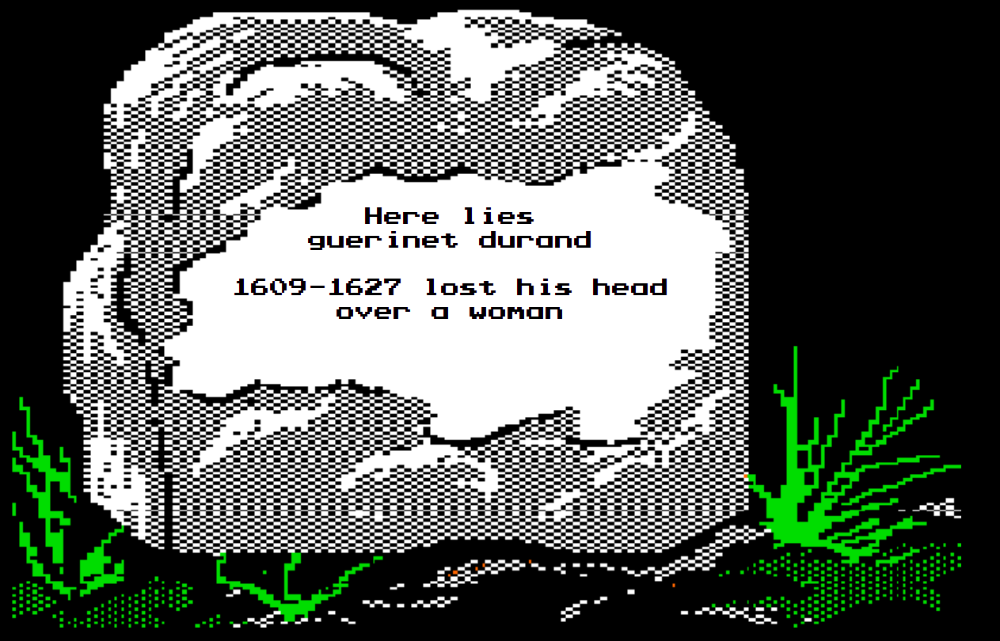

# Henri Toulouse vs. Guerinet Durand

*January 1627 · Red Phillips gentlemen's club, Paris · Cause: the stolen mistress Armadine Demachy — twelve days of Christmas, five golden rings, and a slap with the might of a rigor mortis'd sea bass · sabre against rapier*

The eleventh duel of the game, and on paper the most lopsided ever fought: Guerinet Durand, rapier expertise eleven, against Henri Toulouse, sabre expertise four — a gap so wide the Narrator forced Henri to fold three mandatory Rests into every twelve-turn sequence. Guerinet had entered the game a year earlier declaring that Paris made him "want to open my throat and sing the wonders of being alive," and he fenced like it: over twenty-two rounds he out-damaged Henri 49 points to 40, unveiled a legendary spinning technique that made the club's owner gasp, and by every arithmetic of the fencing tables was winning. Then, on round twenty-two, he dropped his sword to surrender — into a cut already committed. It was the game's only beheading, delivered in the very instant of capitulation, in the club where the dead man was a member in good standing. It was also the second character the same player had lost to a duel over a stolen mistress, a fact the table did not let pass unremarked.

*Editorial note: quoted text is verbatim from the game record; Discord @-mentions inside quotations are rendered as the character's name.*

---

## The quarrel

### The lady (October 1625)

*Armadine Demachy, SL 4, had been Henri Toulouse's mistress for more than a year. He had won her cheaply and without illusions:*

**Narrator** — "Henri Toulouse, roll to court Armadine Demachy (SL 4). With your extravagance, you should be aiming for a 2."

**Henri Toulouse** — "Fairest lady, may I prove a more worthy suitor than a man who has been tried and found guilty for murder."

> 🎲 Henri Toulouse rolls 1d6 — **3** (needed 2: the lady is won)

**Narrator** — "The lady finds you worthy, or perhaps finds herself desperate. Either way, the stars align."

**Henri Toulouse** — "You and I both, dearest heart."

**Hercule Bonaparte** — "Congrats on drawing the attention of the Breadman Killer to you."

**Henri Toulouse** — "A man does not live long in France. May as well make the best of it."

### The Twelve Days of Christmas (January 1627, week one)

*Fourteen game-months later, the first courting roll of the new year opened on an ambush:*

**Narrator** — "Guerinet Durand, roll to court Armadine Demachy. After your extravagance, but taking in consideration her ongoing courtship with Henri Toulouse, you need a 3."

*Henri's player answered the announcement with a single line of nineteen exclamation points. Guerinet's player, meanwhile, laid out the scheme in full:*

**Guerinet Durand** — "You see, Guerinet has been busy this past month with a new tactic. Busy with a letter writing campaign. The target? Why the beautiful and influential lady Armadine." ... "That's right, the little keepsake box she keeps in her armoire is nearly full to busting with notes from her admirer." ... "Once the staff at the Demachy house became used to recieving notes from the messenger, the presents started coming." ... "Armadine received and KEPT the 12 days of Christmas"

**Guerinet Durand** — "That's right, beginning with a partridge in a pear tree!"

**Guerinet Durand** — "Guerinet is particularly happy to pass on the 5 golden ring he scavenged from the battlefield last summer. After all, where would he have been without his military service?" ... "It feels symbolic to him."

> 🎲 Guerinet Durand rolls 1d6 — **5** (needed 3: the lady is stolen)

**Narrator** — "The lady finds her heart fully and totally swept away by the outpouring of romance from the dashing gentleman. We shall see how Henri Toulouse takes the news...."

**Marius Thibodeaux** — "I believe he will not take it the same way the lady took it: lying down."

**Guerinet Durand** — "Guerinet finally shows guys face to Armadine and reveals his identity!" ... "He sweeps her up in his arms for a smooch under the mistletoe still adorning the doorway and waves his hand to shush those drummers and pipers."

**Narrator** — "The lady swoons. Surely nothing could ever tear asunder such a fairy-tale romance."

### The slap

*Henri took the news standing up, and took it to the streets of Paris:*

**Henri Toulouse** — "Henri Toulouse, ever the poor of luck and often the aloof, cannot stand for such an insult. He marches through the streets of France, meeting the cad Guerinet Durand face-to-face, and slaps him with the might of a rigor mortis'd sea bass."

**Jules Lavelle** — "Ha! The cad! It seems well-earned to me."

**Henri Toulouse** — "'A duel, good sir, or you truly have no honor.'"

**Hercule Bonaparte** — "Hearing the commotion from outside, Hercule is drawn to his office window above the street. He looks down on the scene below with his usual impassive steel gaze."

**Jaques Peugeot** — "Walking through the streets, Jaques hears the common raised by Henri. 'How lively this city is!' thinks Jaques as he decides that a nearby bench is where he'd like to eat his sandwich."

**Guerinet Durand** — "Guerinet reels from the hearty slap, but rights himself and smiles. But of course, Henri, when our paths cross we will have our duel. I hope you were studying the blade all those weeks you left Mme. Demarchy alone..."

**Narrator** — "As a reminder: the duellists must, by coincidence or design, be in the same physical location on a given week for a duel to take place."

**Henri Toulouse** — "'I should strike you down now where you stand, but for the sake of your... "decorum", face me the second week of the month. Name your location.'"

**Narrator** — "In case you didn't notice, Henri Toulouse, the two of you are fated to cross paths at Red Phillips on the 2nd week of January as is." ... "No need to arrange anything!"

**Henri Toulouse** — "Ah. Ideal."

### At Red Phillips (week two)

**Narrator** — "On the 2nd week of January, still reeling from losing his love, Henri drowns his sorrows at Red Philips. Who should walk in but his newfound nemesis, Guerinet Durand?"

**Guerinet Durand** — "Oh, Henri Toulouse, how nice to see you...errr, I don't suppose we could put this off to another week. I seemed to have pulled a muscle in my groin, you see .."

*No postponement was granted. The weapons were declared in advance — "(Henri Toulouse, I'll be using a rapier)" from Guerinet, "(Sabre)" from Henri — and the club made ready in its own fashion:*

**Narrator** — "The owner of Red Phillips chuckles. 'Mind the furniture, gents!' The chairs and tables have clearly been broken and reassembled many times already."

---

## The duel

**Narrator** — "Guerinet Durand has the advantage. Henri Toulouse will submit his first twelve turns' worth of actions. Guerinet Durand will submit six."

**Narrator** — "Please confirm that your respective Expertises with your chosen weapons are at 10 and 4."

**Henri Toulouse** — "Acknowledged"

**Guerinet Durand** — "Actually at 11"

**Narrator** — "Due to the vast difference in skill, Henri Toulouse must add 3 extra Rest actions into every 12-turn sequence."

**Narrator** — "The duel begins." ... "After I announce the round, announce your action for that round."

### Round One

**Guerinet Durand** — "Rest"

**Henri Toulouse** — "I rest"

### Round Two

**Guerinet Durand** — "Rest"

**Henri Toulouse** — "I lunge!"

**Narrator** — "Henri's sabre, not well designed for a lunging strike, nevertheless finds its mark. Guerinet receives 8 damage."

**Guerinet Durand** — "Ouch!!!"

### Round Three

**Guerinet Durand** — "Block"

**Henri Toulouse** — "I rest"

### Round Four

**Guerinet Durand** — "Block"

**Henri Toulouse** — "I rest"

### Round Five

**Guerinet Durand** — "Jump back"

**Henri Toulouse** — "I rest" ... "Just kidding, I slash!"

**Narrator** — "Guerinet leaps out of the way of Henri's powerful reverse slash. In his place, a chair is completely destroyed, never to be repaired. The owner is too enthralled by the action to notice."

### Round Six

*Both men rested the round away — "6 rest," "6 rest" — and spent it on words instead:*

**Guerinet Durand** — "Well Henri Toulouse, you've landed a blow on me and the chair. Are you satisfied?"

**Henri Toulouse** — "Not until either you or I can be laid at the lady's feet, a gift for her treachery." ... "Strike, cur."

**Jules Lavelle** — "I thought this whole thing was because you're mad about Guerinet getting laid..."

**Narrator** — "Please wait while Guerinet submits his next twelve actions' worth of routines."

### Round Seven

**Guerinet Durand** — "Rest"

**Henri Toulouse** — "I jump back"

### Round Eight

**Guerinet Durand** — "Lunge"

**Henri Toulouse** — "I rest"

**Narrator** — "Guerinet corrects his wrongfootedness, twirling in the air and landing a perfect forward blow into Henri's chest. Henri takes 14 damage."

**Henri Toulouse** — "hhhrrrrkkkkk"

### Round Nine

**Guerinet Durand** — "Rest"

**Henri Toulouse** — "I block"

### Round Ten

**Guerinet Durand** — "Rest"

**Henri Toulouse** — "I rest"

### Round Eleven

**Guerinet Durand** — "Lunge"

**Henri Toulouse** — "I parry!"

**Narrator** — "Henri perfectly judges the strike, deflecting it masterfully."

**Guerinet Durand** — "Well done!"

### Round Twelve

**Guerinet Durand** — "I rest"

**Henri Toulouse** — "And now I follow with a riposte!"

**Narrator** — "Guerinet's spin continues, leaving him wide open. Henri makes the most of it, scoring a hit for 8 damage."

**Guerinet Durand** — "ahhhh"

**Henri Toulouse** — "I hope the lady likes red"

**Narrator** — "Henri must now submit routines through turn 24."

### Round Thirteen

**Guerinet Durand** — "Lunge"

**Henri Toulouse** — "I rest"

**Narrator** — "The spin continues around into a perfect, cyclical strike. The owner gasps. 'The legends were true! Le Ouroboros!' Henri takes 14 damage."

*Three snake emoji bloomed under the post.*

### Round Fourteen

**Guerinet Durand** — "Rest"

**Henri Toulouse** — "I rest"

### Round Fifteen

**Guerinet Durand** — "Rest"

**Henri Toulouse** — "I slash!"

**Guerinet Durand** — "ergggg"

**Narrator** — "Henri centers himself and delivers an overhead strike, carving off a piece of Guerinet's scalp. Guerinet takes 16 damage."

**Guerinet Durand** — "My hair! My beautiful hair!"

**Narrator** — "The owner guffaws. 'Red Phillips earns his name tonight!'"

**Henri Toulouse** — "I would call it an improvement!!!"

### Round Sixteen

**Guerinet Durand** — "I cut!"

**Henri Toulouse** — "I rest"

**Narrator** — "Guerinet swings his rapier crosswise beneath Henri's nose, gifting him a second set of moustaches. Henri takes 14 damage."

### Round Seventeen

**Guerinet Durand** — "Rest"

**Henri Toulouse** — "I rest"

### Round Eighteen

**Guerinet Durand** — "Rest"

**Henri Toulouse** — "I rest"

**Narrator** — "Please wait while Guerinet submits routines through turn 30."

### Round Nineteen

**Guerinet Durand** — "Rest"

**Henri Toulouse** — "Rest"

### Round Twenty

**Guerinet Durand** — "Rest"

**Henri Toulouse** — "I slash!"

**Narrator** — "Guerinet's long-held ready stance is shattered by Henri's sudden cross-body strike! The attack knocks him backwards across a table, which collapses under his weight. Guerinet takes 16 damage."

**Guerinet Durand** — "gurgle"

**Narrator** — "The owner frowns. 'That one was an heirloom.'"

**Henri Toulouse** — "He's a rather generous sort. It will be on his tab."

**Guerinet Durand** — "gurgle"

### Round Twenty-One

**Guerinet Durand** — "I slash!    .... Somehow"

**Henri Toulouse** — "I rest"

**Narrator** — "Guerinet leaps up onto a chair, which immediately tips forward. He uses the momentum to execute a textbook slash with his rapier, dealing 7 damage to the startled Henri."

**Henri Toulouse** — "hhhhhhhrrrrrrrgghh"

### Round Twenty-Two

**Henri Toulouse** — "I cut!"

**Guerinet Durand** — "I surrender"

**Narrator** — "Guerinet drops his sword. In the same instant, Henri's blade sweeps his opponent's head clear off his shoulders."

---

## The issue

*The record of the seconds that followed is short and perfect:*

**Henri Toulouse** — "Ah." ... "Zut."

**Guerinet Durand** — "Merde"

*(A single ghost emoji appeared beneath the dead man's last word.)*

**Henri Toulouse** — "Hwhelp. I suppose I could always deliver his hand to the lady, since it's what she desired."

**Narrator** — "Henri, as the winner of the duel, you receive 4 SP this month and your base Expertise goes up by one."

**Henri Toulouse** — "Hoorah..." ... "Drinks on me..."

**Narrator** — "The owner scowls. 'That was really too much! He was a member in good standing!'"

**Narrator** — "'Standing a little shorter now, I suppose...'"

**Henri Toulouse** — "Not so good from where I'm standing."

*Nine minutes after the head came off, the announcements channel read "Week 4 passes without incident. January draws to a close," and the tombstone went up in the cemetery:*

**Guerinet Durand, 1609–1627** — *lost his head over a woman*

*Fifteen minutes after that, a stranger's voice was heard in the streets of Paris — Guerinet's player, already back with a fresh character sheet: Pépin Bonheur, newly arrived and asking directions:*

**Pépin Bonheur** — "Ah, Paris, what a frigid city" ... "Is there anyone willing to show an aspiring gent where to warm up in this city?"

**Henri Toulouse** — "Henri, freshly covered in blood, steps out of Red Phillips. 'Aye. I suggest the bawdyhouse for that kind of warmth.'"

*The club kept the scar. When Pépin Bonheur was granted membership at Red Phillips a game-month later, the same player walked his new man across the floor where the old one had died:*

**Pépin Bonheur** — "What a charming establishment! The furniture is so rustic-- reminds me of grandpere's place." ... "Oh, ho hi! Someone must have spilled their wine here. Unless,.   ... Is that a bloodstain? ...a very large bloodstain?"

*And the staff kept the joke. Two game-months on, consoling a losing gambler at the tables:*

**Narrator** — "The croupier chuckles. 'Hard luck, but don't lose your head, there. Lot of that going around.'"

*As for the principals: Henri never re-courted the widowed Armadine — but Pépin Bonheur did ("Ohhhh is there anything greater in all of Paris than the love of a noble woman? I'll be wooing the Beautiful Mme. Demachy at the beginning of the month!"), meaning the same player's next character wooed the same lady who had just cost his last character his head — and she would shortly cost him a duel of his own (see the next page). Henri Toulouse carried his hard-won expertise and his second set of moustaches only four more game-months: he survived the spring campaign of 1627 itself, then died in his tent of a razor drawn by the orphan girl he had rescued. His stone reads: 'twas beauty killed the beast.*

---

## Table talk

**Ghôst Touchard** (as January 1627 opened with the courtship ambush) — "Kicking it off with some debauchery I see.." — and, as Guerinet's letter campaign built to its roll: "@Dice Golem is lying in wait to ruin someone's day.."

**laiv.wire** (upon the Narrator's announcement that his mistress was being courted) — "!!!!!!!!!!!!!!!!!!!"

**Ghôst Touchard** (on Guerinet's "( I'll be using a rapier)") — "those are words I haven't heard in some time!"

**Ghôst Touchard** (the morning of the duel, posting a Magic: The Gathering card illustration titled "Dueling Rapier") — "This came across my timeline and made me think of @Abelard Soucy and the upcoming duel" — **Abelard Soucy**: "I'll take it as a good luck token!" — *and at 10:25 that night, four minutes after the beheading:* "Well @Ghôst Touchard . It didn't work" ... "Time to roll a new character"

**Narrator** (mid-duel, after round six passed in pure trash talk) — "Wait, did we actually get actions for round 6" — **laiv.wire**: "we did not, we just exchanged words, not blows" — **Narrator**: "sorry, I jumped the gun. make sure you declared round 6"

**Jean Renault** (the next day, surveying two characters lost to duels over stolen mistresses) — "Katherine's characters need to be careful when dueling"

---

[← Previous duel](10-1626-sinnoch-vs-lavelle-friendly.md) · [Index](README.md) · [Next duel →](12-1627-dengaux-vs-bonheur.md)
