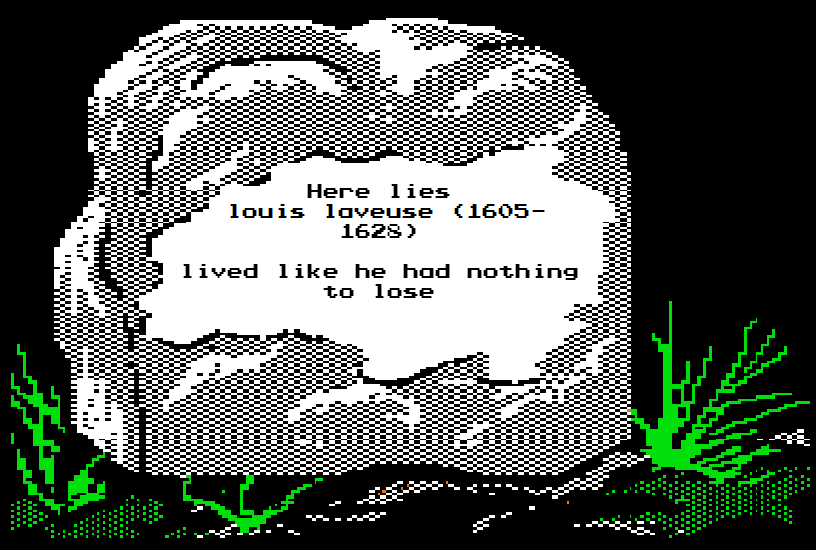

# Jean Shawinigan vs. Louis Laveuse

*January 1628 · Red Phillips gambling club, Paris · Cause: Mlle. Adélaïde Blaise — won and lost in a day · sabre against rapier*

The thirteenth duel of the game, the third fought on the long-suffering floorboards of Red Phillips, and the first ever fought by the player line that had produced Phillipe du Kaneda, Hercule Bonaparte, and Sébastien Lefebvre — four characters and nearly four real years without once crossing steel. The man who finally broke the streak was Jean Shawinigan: outwardly a disowned merchant's son of impeccable calm, actually a time traveler stranded in the 1600s with a neural link, implanted sobriety meds, and an anti-aging regimen. Across from him stood Louis Laveuse, "the bastard spawn of the Earl of Ambroise and a washerwoman" — the newest character of the player whose Robert d'Engaux had won the previous duel at this very club, then died at La Rochelle holding the affections of Adélaïde Blaise. Louis re-courted his predecessor's lady and won her; the next day Jean bought a private festival and took her away. The gossips of Paris said she chose Louis "for about an hour." The duel that settled it lasted eleven rounds, ended in the worst single stroke the club had ever hosted, and produced the most seventeenth-century last words in the whole chronicle.

*Editorial note: quoted text is verbatim from the game record; Discord @-mentions inside quotations are rendered as the character's name.*

---

## The quarrel

### The duelists

*Louis Laveuse entered the game in November 1627, rolled up the same evening his player's previous character died — alongside an accidental bonus mistress:*

**Louis Laveuse's player** — "Two Fresh arrivals in Paris: one a wealthy heiress from Normandy, Marie d'Rouen (SL:15)" ... "The other, the bastard spawn of the Earl of Ambroise and a washerwoman, Louis Laveuse"

*Jean Shawinigan had arrived the same season, taking possession of the late Hercule Bonaparte's empty manor and dictating his situation report into a small silver disc:*

**Jean Shawinigan** — "I have sold what I could from the ship and hid the rest in a nearby cave. Since what remains isn't exactly livable, I have relocated to Paris to try and make the best of the situation. Fortunately, the salvage netted me a healthy bit of coin and I was able to invest it in a number of businesses which the historical database says will pay dividends for decades to come. ... Hopefully, I won't need them. But if I'm going to be stuck in the 1600s, I certainly am not going to do it as a pauper. ... So instead Jean Shawinigan will arrive in Paris and do the things young rich men do. Calculations are that the damage to the timeline will be minimal. But maybe I should damage the timeline? Tough choice: Life stuck as a wealthy gentleman in the 1600s or stuck in a temporal prison in the 2800s?"

*He joined Red Phillips in December 1627, and got an early reading on the establishment where he would fight his first duel:*

**Jean Shawinigan** — "Jean enjoys numerous drinks at the club and overindulging with the locals. His frolicking is briefly interrupted when the passive scanners on his neural-link detect that some of the floor boards are composed of more human blood than wood. He spends a brief moment contemplating his surroundings before temporarily disabling the implant which sobers him up when it thinks he is in danger. After all, sobriety meds are going to be in short supply for another six hundred years."

### Won and lost in a day (December 1627)

**Narrator** — "Louis Laveuse, roll to court Adélaïde Blaise (SL 9). With your extravagance, you need a 3."

> 🎲 Louis Laveuse rolls 1d6 — **4** (needed 3: won)

**Narrator** — "The lady is swept away by his gallantry."

*One day later — one game-week at most:*

**Narrator** — "Lucky lady Blaise is visited by another this month. Jean Shawinigan, roll to court the lady (SL 9). With your extravagance, even with her current suitor, you need a 2 (you can never bring it down to 1)."

**Jean Shawinigan** — "The rules of love in the 1600s starkly contrasted with the rules of love in the 2800s. Jean knew that casual hookups were not the kind of thing that were going to fly in this day and age. So if he was going to be stuck with a single partner, it was going to be one of the most beautiful and influential in Paris. Such a lady would be highly sought after, so Jean knew he would have to pull out all the stops.
Naturally, Ms. Blaise was a little confused at Jean's invitation to a festival in the park. Surely something like that would have been on the local social calendar. It was even more to her surprise to find out the festival had been privately funded by Jean to be held solely for the purpose of their outing. The entertainment of the local Parisians was merely a happy coincidence.
It was an ostentatious and grand gesture of wealth. But was it too much?"

> 🎲 Jean Shawinigan rolls 1d6 — **3** (needed 2: won)

**Narrator** — "The lady's heart turns on a crown. 'Louis?' she's heard to say to one of her curious friends, 'Who is Louis? My heart belongs to Jean.'"

*Paris noticed immediately. In the streets, on the way to a New Year's party at the Horse Guards:*

**Jean Renault** — "*while gossiping with his mistress on the way to a new years party at the Horse Guards* — I still cannot believe that Mlle Blaise had yet another two suitors this month! And the scandalous rumor is that she chose one for about an hour, before leaving him for the other!" ... "Such humiliation!" ... "I wonder if the first suitor will attempt to recover his honor?" ... "Otherwise, how will anyone in Paris take him serious after such a sleight?"

### The challenge

*He would. The first suitor posted his challenge directly to the dueling grounds:*

**Louis Laveuse** — "Upon strolling through the streets of Paris one morn, Louis spots his beloved shopping with Jean Shawinigan. Naturally such an insult to his name cannot stand and Louis challenges the chap to a duel in the 1st week of this month"

**Jean Shawinigan** — "Initially worried about the consequences of such a duel, Jean sighs relief when his neural link kicks in: 'Threat assessment: Limited - Temporal Relevance: Negligible' — I believe the lady is free to make whatever choices she desires. So this all seems very foolish and is unlikely to change anything. However, if you insist that me hurting you will make you feel better, I can oblige and add you to my itinerary for the first week of the month."

**Jean Shawinigan** — "Shall we meet at Red Phillips that week?"

**Louis Laveuse** — "Very well sir"

**Jean Shawinigan** — "Jean's neural link switches to calendar mode and adds the entry: Give a beatdown to some rando"

*In the streets, the spectator gallery organized itself:*

**Jean Renault** — "I have heard rumors of a duel going on this month at Red Phillips, but alas, I am not a member of the club!" ... "Would anyone be willing to host myself? It's been so long since I have been able to witness such a spectacle!"

**Jean Shawinigan** — "Of course. I'll be there all week, in case Louis Laveuse gets lost and is late."

**Louis Laveuse** — "I must confess it is not an establishment that I am familiar with."

**Jean Renault** — "Well then fellow Jean, Jean Shawinigan, may I accompany you to Red Phillips to watch the duel?" ... "If you are killed, I will be happy to pick up your tab for that day!" ... "And if you are victorious, I will be happy to buy you a drink and celebrate!"

**Jean Shawinigan** — "I shall leave your name at the door, fellow Jean. And, unless M. Laveuse is insistent on bleeding all over the floor, I doubt it will come to too much bloodletting."

### The appointed hour (first week of January 1628)

**Narrator** — "The atmosphere at Red Phillips is tense. A crowd has assembled before the gentlemen even arrive; it is well-known on the streets what will transpire here today. Jean Shawinigan arrives first, Mlle. Blaise on his arm, though she seems thoroughly unimpressed with the place."

**Narrator** — "The normally boisterous clientele stares at the gentleman and his lady as they enjoy their libations. From time to time, they look back to the door, wondering when Louis Laveuse will arrive."

**Jean Shawinigan** — "Upon confirming the levels of sobriety meds in his implant, Jean makes it a point to forget about the upcoming violence and focus on enjoying himself with his new companion. Between the alcohol and some minor assistance from his adrenal regulator, an outside observer would simply see a man enjoying his day without a care in the world."

**Louis Laveuse** — "As the appointed hour comes and goes, the crowd begins to grow less and less enthusiastic. Mutters of 'coward' are heard as some return to the bar and others wander out to seek entertainment elsewhere
At last, Louis arrives. 'my apologies, monsieur, this err...' *he glances around* 'establishment was not faniliar to me. Let's get this over with, so I and the lady can return to somewhere more... upscale'"

**Jean Shawinigan** — "Yes yes, we'll get to it. Just let me finish my brandy first. Feel free to pull up a chair and get one of your own. Just because we're about to maul each other, doesn't mean we can't enjoy ourselves first." ... "Jean then takes a sip of his brandy, turning his back to Louis and giving a casual, but discrete, wink at Mlle. Blaise while donning a mischievous grin."

**Louis Laveuse** — "Louis takes a look at his opponent, fooled by his adrenal regulator and the mutterings he hears in the remaining crowd, he believes his opponent to be somewhat overwrought. 'This will be too easy,' Louis thinks to himself, 'and to think of how my father kicked me out, he'll see what I shall make of myself! They shall all see!'" ... "'Of course, I wouldn't want to have any unfair advantage over you my friend'" ... "Louis orders a glass of the 09 but finds himself having to make do with something of less exalted provenance"

**Jean Shawinigan** — "As Jean finishes his brandy and sees Louis still has half a glass left, he orders another"

**Louis Laveuse** — "Louis looks sadly into his drink and prays that his return to a more fashionable establishment will not be long delayed."

---

## The duel

**Narrator** — "are the duelists each at 8 EXP with their weapon of choice?"

**Louis Laveuse** — "I definitely am"

**Jean Shawinigan** — "Yes"

**Narrator** — "As the duelists are evenly matched, there will be no staggered submission; each duelist will submit a full 12 rounds' worth of actions each entry"

**Louis Laveuse** — "Louis draws his rapier and makes his way through the crowd"

**Jean Shawinigan** — "Jean leisurely gets up and stretches, activating his implanted sobriety meds and adjusting his hormone balance for combat. To the outside observer, the man can clearly drink like a fish. He draws his sabre and moves into position for the duel." ... "Again my friend, this seems kind of foolish. The lady clearly made her choice."

**Louis Laveuse** — "No doubt she shall see through your tricks soon enough"

**Narrator** — "Duel will commence once both duelists have submitted their first 12 rounds."

**Jean Shawinigan** — "You should have mine."

**Narrator** — "The duel begins."

### Round One

**Louis Laveuse** — "Rest"

**Jean Shawinigan** — "Close"

### Round Two

**Jean Shawinigan** — "Kick"

**Louis Laveuse** — "Rest"

**Narrator** — "Louis's eyes are fixed on the wicked edge of Jean's sabre. So fixed that he never sees the standing high kick that takes him fully in the face, splintering his cheekbone. Louis takes 30 damage."

*(The table reacted: 😱 😱 😱. And a note for the record —)*

**WillWorker** — "*Sabre"

### Round Three

**Jean Shawinigan** — "Rest"

**Louis Laveuse** — "Block"

### Round Four

**Jean Shawinigan** — "Rest"

**Louis Laveuse** — "Rest"

### Round Five

**Jean Shawinigan** — "Rest"

**Louis Laveuse** — "Lunge!"

**Narrator** — "As Jean eyes his foe warily, an early feint causes him to mistime the next incoming strike. Jean is stabbed for 22 damage."

### Round Six

**Jean Shawinigan** — "Rest"

**Louis Laveuse** — "Rest"

### Round Seven

**Louis Laveuse** — "Block"

**Jean Shawinigan** — "Slash"

**Narrator** — "Louis has found the rhythm, and catches Jean's mighty blow." ... "Louis, roll 1d6 for weapon breakage."

> 🎲 Louis Laveuse rolls 1d6 — **6** (the blade holds)

**Narrator** — "The rapier withstands the impact!"

### Round Eight

**Louis Laveuse** — "Close"

**Jean Shawinigan** — "Rest"

### Round Nine

**Jean Shawinigan** — "Slash"

**Louis Laveuse** — "Kick"

**Narrator** — "Jean takes the opportunity of his opponent's approach to smash his saber into Jean's collarbone, digging into the ivory for 20 damage. At the same time he accepts the strike, Louis steps forward once more, bringing his knee up firmly into Jean's... seat of power for 22 damage."

*(The sabre found Louis's collarbone; the knee found Jean's crown jewels. Fifty damage on Louis now, forty-four on Jean. The table reacted: 🦶 🦶 👑)*

### Round Ten

**Jean Shawinigan** — "Rest"

**Louis Laveuse** — "Rest"

### Round Eleven

**Louis Laveuse** — "Rest"

**Jean Shawinigan** — "Cut"

**Louis Laveuse** — "Ouch"

**Narrator** — "Jean refuses to relent, letting the tip of his sabre punctuate the conversation. A whistling sound is heard, and the spray of blood coats everyone within Red Philips, a perfect crimson circle. Louis takes 40 damage."

**Jean Shawinigan** — "Computing temporal distortion...
...
...
Temporal distortion within reasonable safety limits"

**Louis Laveuse** — "*Louis looks down,* Mon dieu! Look what you have done to my coat. Father will be so angry *he mutters as he falls to the floor*"

**Jean Shawinigan** — "I tried to warn you, my friend." ... "Jean's tone is one of neutral compassion."

**Narrator** — "The owner facepalms. 'Not another one!'"

---

## The issue

*Louis Laveuse died on the club floor at ninety damage taken in eleven rounds — a splintered cheekbone, a sabre in the collarbone, and a cut that opened him in a perfect crimson circle. Jean finished at forty-four, upright, his biometrics already forecasting recovery. The dueling record ends mid-scene on the owner's facepalm; the bookkeeping was settled at the table:*

**WillWorker** — "Narrator — That counts as a Neutral Win for SP purposes?"

**Narrator** — "neutral win AND killing"

*The Narrator posted the tombstone five minutes after the body hit the floor:*

**Here lies Louis Laveuse (1605–1628)** — *lived like he had nothing to lose*

*And the victor walked the disputed lady home, delivering the coldest tender speech in the chronicle:*

**Jean Shawinigan** — "Jean returns to his lady, his biometric report projecting his wounds will be fully healed by the end of the month

I'm not sure what to say about the gruesome scene you just witnessed. And I cannot say if that man was motived by pride or love. But he did die for you.

I can't say I would be willing to do the same. But at least we've established that I would kill for you and return alive. And while I have no intention of being the arbiter of your heart, one action does have longer term prospects than the other.

Come. I have no wish to celebrate over a dead fool. I'll walk you home and call on you in the morn."

*(The table reacted: ❤️ ❤️ ❤️)*

*The courtship held. Jean spent the remainder of January at Red Phillips, in the record's own words "a deeply inebriated Jean who all month has been hosting the lady he killed for" — and closed the month by drunkenly lecturing the ruined gambler Jerome Greybeck on the economics of the seventeenth century, then departing with Mlle. Blaise on his arm: "Whether intentionally or in his drunken stupor, Jean has left his coin purse behind. Inside are 250 Crowns."*

*As for the loser: his player was rolling dice for a new character within two minutes of Louis's fall. The result was Pierre d'Amboise — a legitimate son of the very house whose name Louis breathed with his dying words. Pierre's introduction, posted a week later, contains the family's entire eulogy for the washerwoman's son:*

**Pierre d'Amboise** — "Even the bastard Louis had been sent in the hope of returning with loot from somewhere or other, although he had not now been heard from for a week and was not particularly missed anyway."

*Father, it seems, was not so angry after all.*

---

## Table talk

**ArcticFox** (the day the lady changed hands) — "It feels like Adélaïde Blaise gets passed around" ... "Shes flaky sure, but her suitors also seem to die" — **WillWorker**: "Makes me glad I factored in a suitor hedge into my spend."

**Narrator** (chasing monthly orders) — "Waiting on orders from Curtis Sinnoch, Jean Renault, CitrusNotes, Joseph Bousain. Waiting on Jean S. as well but he used his time travel powers to know when he would get in and forewarn me."

**sirsfurther** — "Waiting to here when certain ppl are free for.duels" — **WillWorker**: "Nothing to wait for, no challenges have actually been issued publicly. Just rumored about." — **sirsfurther**: "I HEREBY CHALLENGE YOU TO A DUEL GOOD SIR!" — **WillWorker**: "Wrong channel"

**WillWorker** (four characters, four years, zero duels until now) — "After all this time, I finally get to duel!!!!!"

**WillWorker** (scheduling a killing) — "I'm just winding down at the office. I can do this now or later in the evening after I get home." — **sirsfurther**: "I'm abt to go to bed actually, how abt tomorrow?"

**sirsfurther** (waiting on a delayed GM, fully in character) — "Another brandy, Jean?"

---

[← Previous duel](12-1627-dengaux-vs-bonheur.md) · [Index](README.md)
